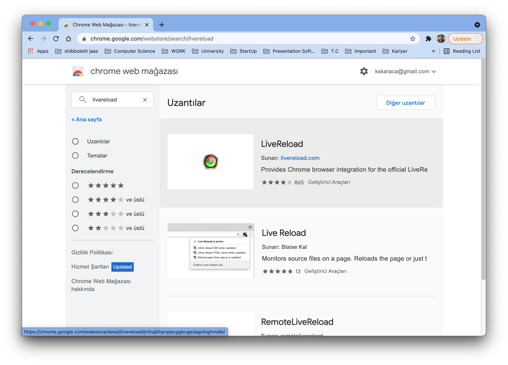
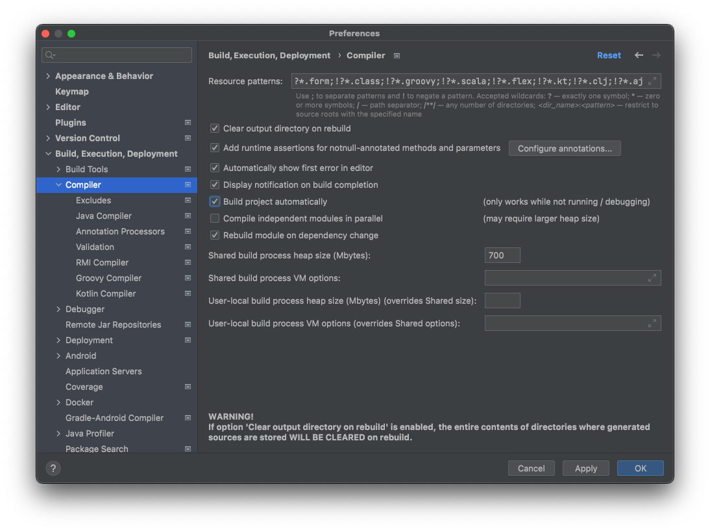
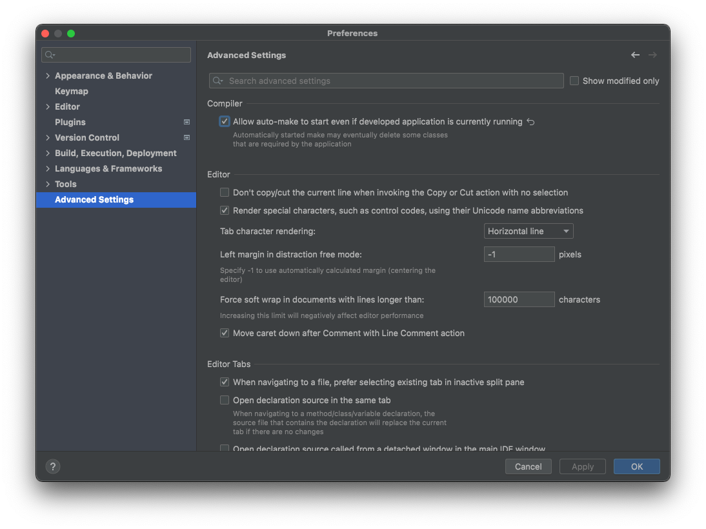

# Spring Boot - Intellij Idea

## İçindekiler

1. [Gereksinimler](#gereksinimler)
2. [Intellij Idea](#intellij-idea)
   1. [2020.2.2](#202122)
3. [Kaynaklar](#kaynaklar)

## Gereksinimler

* Intellij Idea

## Intellij Idea
Intellij üzerinde Spring uygulaması geliştirirken değişiklikler sonrasında Spring restart edilmesi gerekilmektedir.

Intellij üzerinden bazı ayarlamalar yapılarak değişikliklerin restart edilmeden aktarılması (`livereload`) sağlanmalıdır.

### Chrome Extension
LiveReload için Chrome extension kurulması gerekir.

### 2021.2.2
Intellij üzerinde aşağıdaki değişiklikler yapılarak uygulamanın otomatik olarak restart edilmesi sağlanır. Bu yöntem ile uygulamanın restart edilecektir.   

## Kaynaklar

- https://spring.io/projects/spring-boot
- https://stackoverflow.com/questions/33869606/intellij-15-springboot-devtools-livereload-not-working
