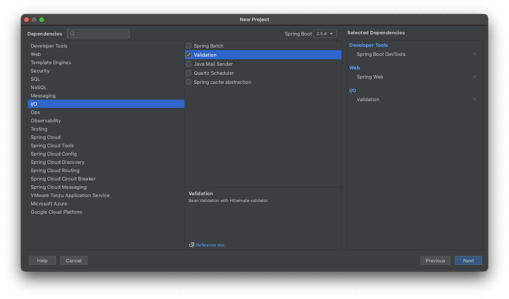
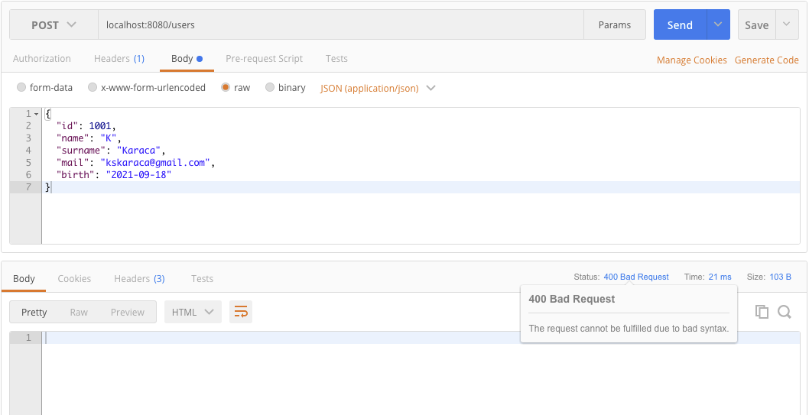
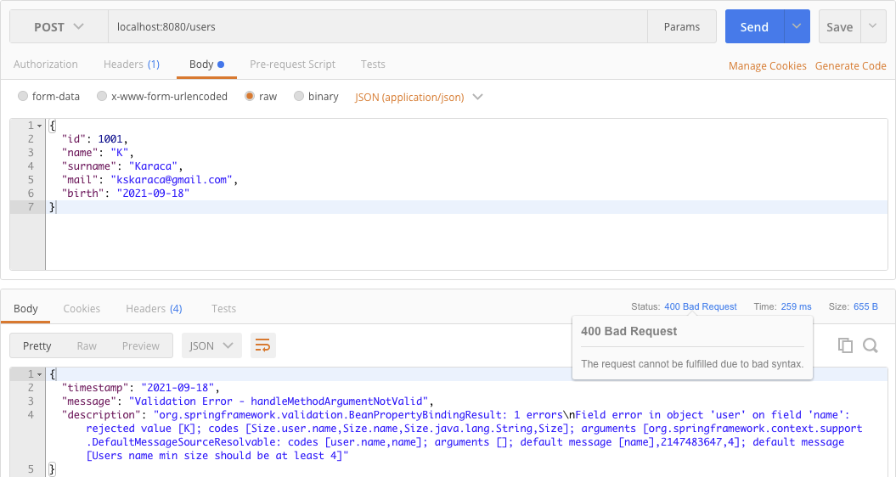

# Spring Boot - Java 8 Example


## İçindekiler
1. [Gereksinimler](#gereksinimler)
2. [Validation Dependency](#validation-dependency)
3. [Validation](#validation)
4. [Validation Exception Handler (ResponseEntityExceptionHandler)](#validation-exception-handler-responseentityexceptionhandler)
5. [Validation Exception Handler (@ExceptionHandler)](#validation-exception-handler-exceptionhandler)
6. [Validation Packages](#validation-packages)
7. [Kaynaklar](#kaynaklar)
	

## Gereksinimler
 * Spring Web
 * Spring Boot DevTools
 * Validation


## Validation Dependency
Spring Validation özelliğinin kullanılabilmesi için proje oluşturulurken I/O başlığı altından `Validation` bağımlılığı eklenir.




Direk dependency olarak eklemek istiyorsak maven projesi için `pom.xml` dosyasına aşağıdaki gibi `Validation` bağımlılığı eklenir.
```xml
<dependencies>
    <dependency>
        <groupId>org.springframework.boot</groupId>
        <artifactId>spring-boot-starter-validation</artifactId>
    </dependency>
    <!-- other dependecies -->
</dependencies>
```


## Validation
Standart web uygulamalarında gelen post request'lerin doğrulanması(`validate`) gerekir. 

Örn. yeni bir User kayıt edilmesi(post) durumunda gelen User değerlerinin doğru olup olmadığı kontrol edilmelidir. Mail belirli standartlarda mı veya doğum tarihi uygun mu gibi...


## Validation Exception Handler (ResponseEntityExceptionHandler)
Bir istek validation durumundan geçemiyorsa Spring bu isteğe default olarak `400 Bad Request` header ile içeriği boş olan body response dönmektedir. 



Response header ve body özelleştirilmesi istenirse exception başlığı altında anlatıldığı gibi `ResponseEntityExceptionHandler`'dan yararlanılır. 

`ResponseEntityExceptionHandler.handleMethodArgumentNotValid` metodu Override edilerek Validation'dan kaynaklanan exception'ların üstesinden gelinir.

```java
@ControllerAdvice
public class CustomResponseEntityExceptionHandler extends ResponseEntityExceptionHandler {
    //..
    @Override
    public ResponseEntity handleMethodArgumentNotValid(MethodArgumentNotValidException ex, HttpHeaders headers, HttpStatus status, WebRequest request){
        CustomException customException = new CustomException(new Date() , "Validation Error - handleMethodArgumentNotValid" , ex.getBindingResult().toString());
        return new ResponseEntity(customException , HttpStatus.BAD_REQUEST);
    }
    //..
}
```

Kod parçasındaki gibi değişiklik yapılmasıyla aşağıdaki gibi bir sonuç dönecektir. 



> `Users name min size should be at least 4` değeri uyarısı User class'ındaki @Size(min=4, message="...") alanından almaktadır.


## Validation Exception Handler (@ExceptionHandler)
Validation Exception'larını özelleştirmenin bir diğer yolu ise @ExceptionHandler annotation kullanılmasıdır.

```java
@ResponseStatus(HttpStatus.BAD_REQUEST)
@ExceptionHandler(MethodArgumentNotValidException.class)
public Map<String, String> handleValidationExceptions(MethodArgumentNotValidException ex) {
    Map<String, String> errors = new HashMap<>();
    ex.getBindingResult().getAllErrors().forEach((error) -> {
        String fieldName = ((FieldError) error).getField();
        String errorMessage = error.getDefaultMessage();
        errors.put(fieldName, errorMessage);
    });
    return errors;
}
```


## Validation Packages
Spring'te kullanılan birden fazla validation kütüphanesi olabilir. 
- hibernate-validator (@Range, @NotEmpty ...)
- validation-api (@Size, @Past ...)

Eğitimde kullanılan @Size, @Past gibi validation annotation'ları `validation-api` tarafından sağlanmaktadır.


## Kaynaklar
- https://spring.io/projects/spring-boot
- https://www.baeldung.com/spring-boot-bean-validation

