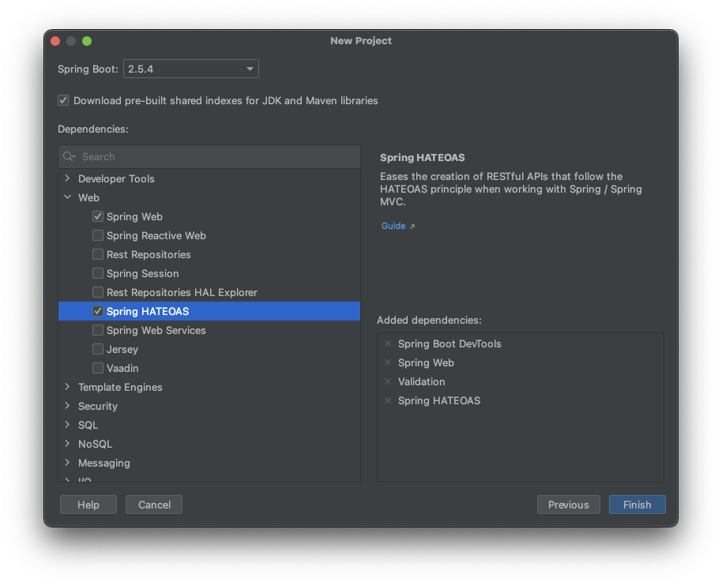

# Spring Boot - Java 8 Example


## İçindekiler
1. [Gereksinimler](#gereksinimler)
2. [HATEOAS](#hateoas)
3. [HATEOAS Dependency](#hateoas-dependency)
4. [EntityModel<>](#entitymodel)
5. [WebMvcLinkBuilder](#webmvclinkbuilder)
6. [Kaynaklar](#kaynaklar)
	

## Gereksinimler
 * Spring Web
 * Spring Boot DevTools
 * Validation
 * HATEOAS

## HATEOAS

`HATEOAS (Hypermedia as the Engine of Application State)`, REST uygulama mimarisini diğer mimarilerinden ayıran bir kısıtlamadır.

Bir REST istemcisi(client), genel bir `hypermedia` anlayışının ötesinde, bir uygulama veya sunucuyla nasıl etkileşime girileceği konusunda ön bilgi sağlar. 

Örn. 12345 hesap numarasının bilgileri `GET /accounts/12345` ile istenildiğinde aşağıdaki gibi bir sonuç dönülebilir. Bu durumda istemci daha fazla bilgiye erişememektedir.  

```json
{
    "account": {
        "account_number": 12345,
        "balance": {
            "currency": "usd",
            "value": 100.00
        }
    }
}
```

Çekilen hesap bilgilerinin yanında erişilebilecek diğer linklerin bulunması durumunda ise istemci hesapla alakalı daha fazla bilgiye erişecektir. Bu durum `HATEOAS` olarak adlandırılmaktadır. 
```json
{
    "account": {
        "account_number": 12345,
        "balance": {
            "currency": "usd",
            "value": 100.00
        },
        "links": {
            "deposits": "/accounts/12345/deposits",
            "withdrawals": "/accounts/12345/withdrawals",
            "transfers": "/accounts/12345/transfers",
            "close-requests": "/accounts/12345/close-requests"
        }
    }
}
```


## HATEOAS Dependency
Spring HATEOAS özelliğinin kullanılabilmesi için proje oluşturulurken Web başlığı altından `HATEOAS` bağımlılığı eklenir.




Direk dependency olarak eklemek istiyorsak maven projesi için `pom.xml` dosyasına aşağıdaki gibi `HATEOAS` bağımlılığı eklenir.
```xml
<dependencies>
    <dependency>
        <groupId>org.springframework.boot</groupId>
        <artifactId>spring-boot-starter-hateoas</artifactId>
    </dependency>
    <!-- other dependecies -->
</dependencies>
```


## EntityModel
HATEOAS için `EntityModel` class'ı kullanılır. HATEOAS için geliştirilmiş bu class aslında content olarak dönmek istediğimiz objeye ek olarak HATEOAS linklerini de beraberinde dönmektedir.  

Aşağıdaki iki controller arasındaki tek fark, HATEOAS kullanılan yani EntityModel cevap dönen Response header'ında content-type olarak `application/hal+json` tanımlıdır. 

```java
@RestController
public class UserController {
    // ...
    @GetMapping(path = "users/{id}")
    public EntityModel getUser(@PathVariable int id){
        User user = userService.findById(id);
    
        if(user==null)
            throw new UserNotFoundException("User " + id + " not found");
    
        return EntityModel.of(user);
    }
}
```

```java
@RestController
public class UserController {
    // ...
    @GetMapping(path = "users/{id}")
    public User getUser(@PathVariable int id){
        User user = userService.findById(id);
    
        if(user==null)
            throw new UserNotFoundException("User " + id + " not found");
    
        return user;
    }
}
```


## WebMvcLinkBuilder
Response olarak EntityModel dönülmesi yeterli değildir. HATEOAS ile data yanında aynı zamanda linklerin de gelmesi gerekmektedir.

`WebMvcLinkBuilder` static metodları kullanılarak rahatça link oluşturulabilir.

```java
public class UserController {

    // ...
    
    @GetMapping(path = "users", name = "user-list")
    public List<User> getUserList(){
        return userService.findAll();
    }
    
    // ...
    
    @GetMapping(path = "users/{id}")
    public EntityModel getUser(@PathVariable int id){
        User user = userService.findById(id);

        if(user==null)
            throw new UserNotFoundException("User " + id + " not found");

        EntityModel entityModel = EntityModel.of(user);

        // Adding model links
        WebMvcLinkBuilder webMvcLinkBuilder = WebMvcLinkBuilder.linkTo(WebMvcLinkBuilder.methodOn(this.getClass()).getUserList());
        entityModel.add(webMvcLinkBuilder.withSelfRel());
        entityModel.add(webMvcLinkBuilder.withRel("all-users"));
        entityModel.add(new Link("http://localhost:8080/users"));

        return entityModel;
    }
}
```

En temel WebMvcLinkBuilder static fonksiyonları:
- linkTo()
- methodOn()

> Görüldüğü üzere "new Link()" ile link oluşturulabilir. Ancak servis isim değişikliğinden etkilenilmemesi için WebMvcLinkBuilder daha kullanışlıdır.  


## Kaynaklar
- https://spring.io/projects/spring-boot
- https://en.wikipedia.org/wiki/HATEOAS 
- https://en.wikipedia.org/wiki/Hypermedia
