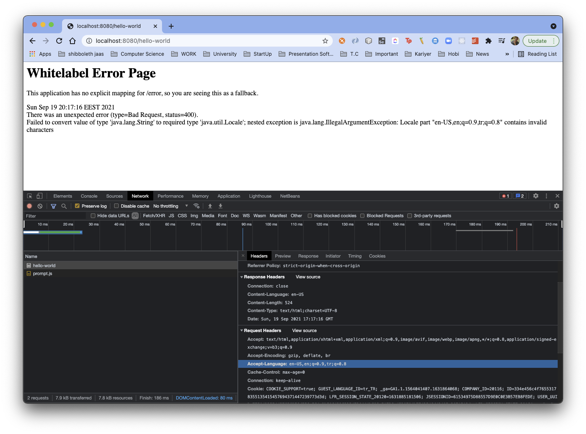
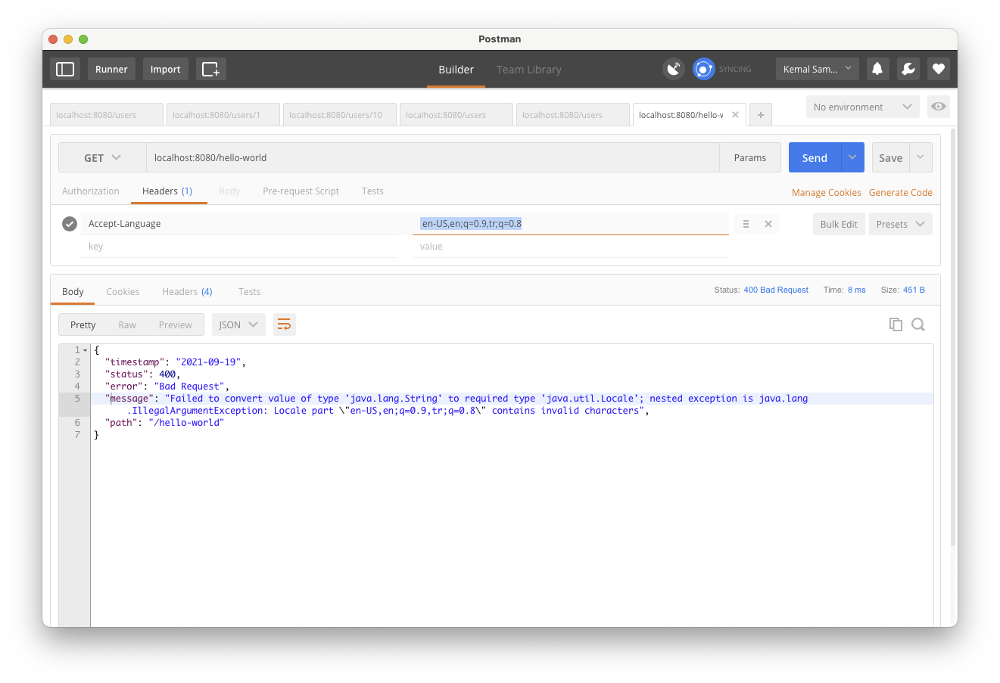
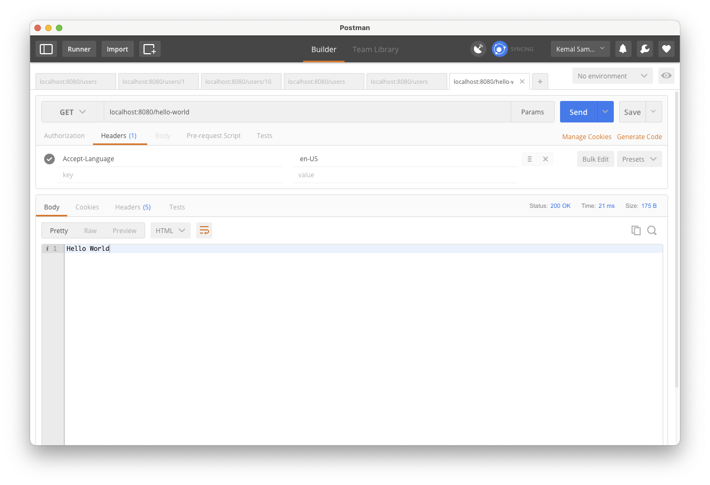

# Spring Boot - Java 8 Example


## İçindekiler
1. [Gereksinimler](#gereksinimler)
2. [Internationalization - i18n](#internationalization---i18n)
3. [Accept-Language](#accept-language)
4. [messages.properties](#internationalization---i18n)
5. [MessageSource](#messagesource)
6. [Kaynaklar](#kaynaklar)
	

## Gereksinimler
 * Spring Web
 * Spring Boot DevTools
 * Validation
 * HATEOAS

## Internationalization - i18n
Internationalization, uygulamanın farklı dillerde kullanılması anlamına gelmektedir. Bazı kaynaklarda i18n olarak geçer.

i18n anlamı `i` karakteri ile başlayıp `n` karakteri ile biten ve arasında 18 karakter olan `internationalization` kelimesinin kısaltılmış halidir.


## Accept-Language
Request header'da `Accept-Language` değerinin tanımlı tanımlanarak isteğin hangi dilde olacağı belirtilir.

Chrome default olarak Request header'da `Accept-Language: en-US,en;q=0.9,tr;q=0.8` tanımlamaktadır. Bu durum Spring'de aşağıdaki gibi hataya sebep olmaktadır. 


Postman üzerinde aynı istek tekrarlanırsa aşağıdaki gibi bir hata ile karşılaşılır.


Postman üzerinde Accept-Language değerinin sadece en-US gibi bir değer olması durumunda hata yerine sonuç doğru gelir. 



## messages.properties
Farklı dillerde destek verebilmek için `messages.properties` dosyasının oluşturulması gerekmektedir.

```properties
hello.world=Hello World
```

- messages.properties
- messages_tr.properties
- messages_fr.properties
- ...

## MessageSource 
MessageSource objesi oluşturularak `getMessage` metodu kullanılarak `messages.properties` dosyasından değer alınabilir.

@GetMapping metodlarından locale değeri iki şekilde alınabilir. 
- @RequestHeader
- LocaleContextHolder.getLocale()

```java
@RestController
public class HelloWorld {

    @Autowired
    MessageSource messageSource;

    @GetMapping(path = "hello-world-1")
    public ResponseEntity helloWorld(@RequestHeader(name="Accept-Language" , required = true) Locale locale){
        String content = messageSource.getMessage("hello.world" , null , locale);
        return ResponseEntity.ok(content);
    }

    @GetMapping(path = "hello-world-2")
    public ResponseEntity helloWorld(){
        String content = messageSource.getMessage("hello.world" , null , LocaleContextHolder.getLocale());
        return ResponseEntity.ok(content);
    }

}
```

## Kaynaklar
- https://spring.io/projects/spring-boot
