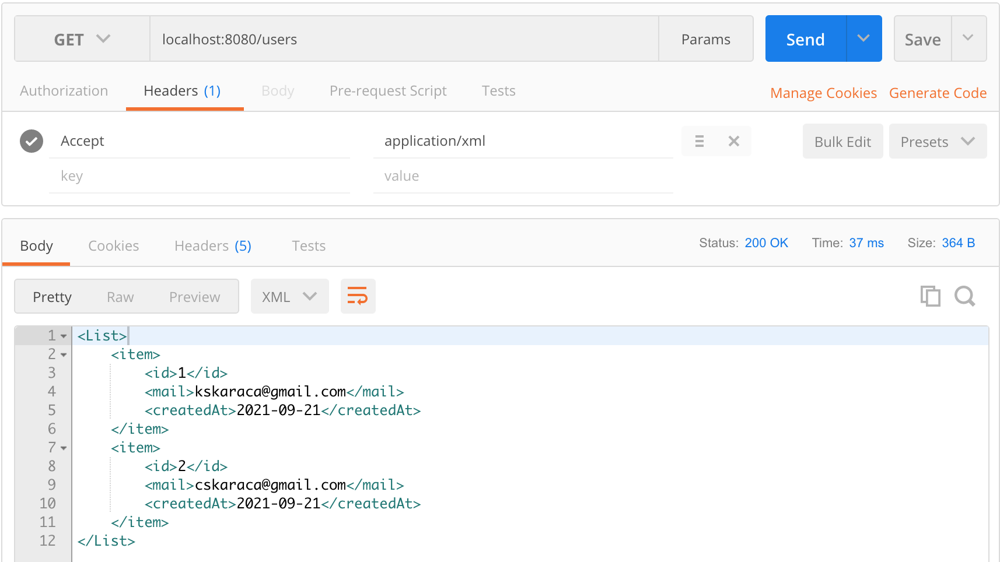

# Spring Boot - Java 8 Example


## İçindekiler
1. [Gereksinimler](#gereksinimler)
2. [Content Negotiation](#content-negotiation)
3. [Content Negotiation Dependency](#content-negotiation-dependency)
4. [Accept Header](#accept-header)
5. [Kaynaklar](#kaynaklar)
	

## Gereksinimler
 * Spring Web
 * Spring Boot DevTools
 * Validation
 * HATEOAS


## Content Negotiation
`Content Negotiotion`, bir kaynağın aynı URI'da farklı şekillerde sunmak için kullanılan mekanizmadır. 

Örneğin `seruvent.com.tr/users` ile kullanıcılarımızı dönen rest sayfamız olsun. Bu sayfaya bir istek yapıldığında normalde JSON formatında dönecektir. 

Request header'da bulunan Accept değerin formatını xml yapılması durumunda sonuç xml formatında geliyorsa bu mekanızma `Content Negotiation` olarak adlandırılır. 


## Content Negotiation Dependency
Spring ile Content Negotiation otomatik olarak sağlanmaktadır. Kod üzerinde hiçbir değişikliğe gerek yoktur.

```xml
    <!-- Accept application/xml -->
    <dependency>
        <groupId>com.fasterxml.jackson.dataformat</groupId>
        <artifactId>jackson-dataformat-xml</artifactId>
    </dependency>
```


## Accept Header
Postman üzerinden `Accept` header ile yapılan isteğin sonucu resimdeki gibidir.  




## Kaynaklar
- https://spring.io/projects/spring-boot
- https://developer.mozilla.org/en-US/docs/Web/HTTP/Content_negotiation
