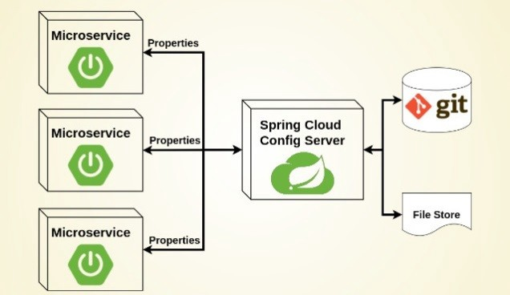
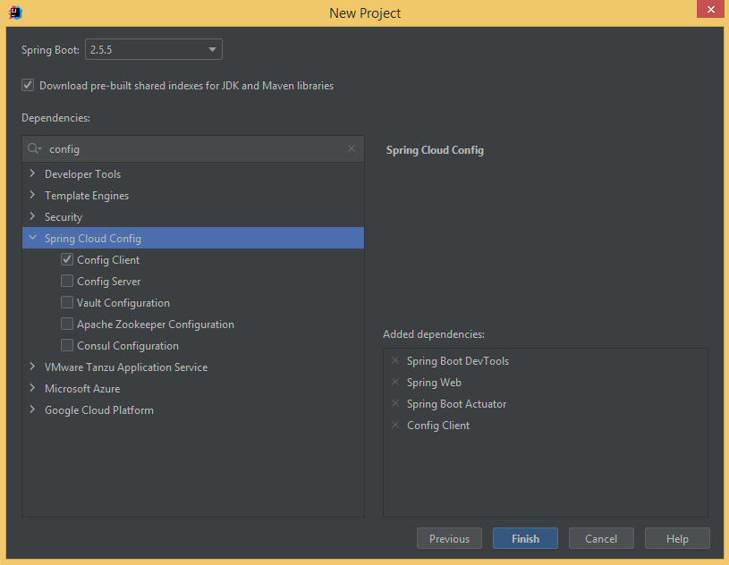
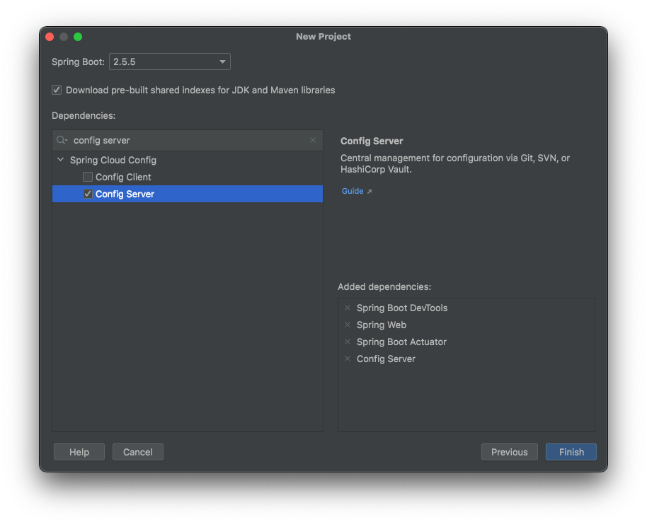
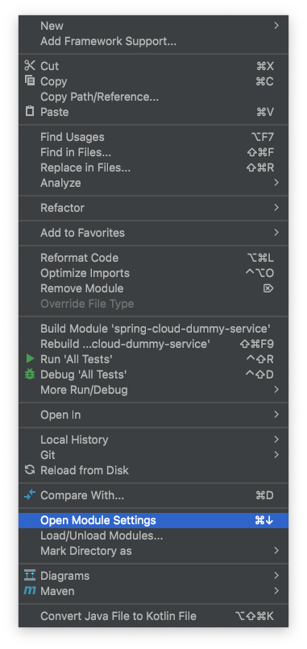
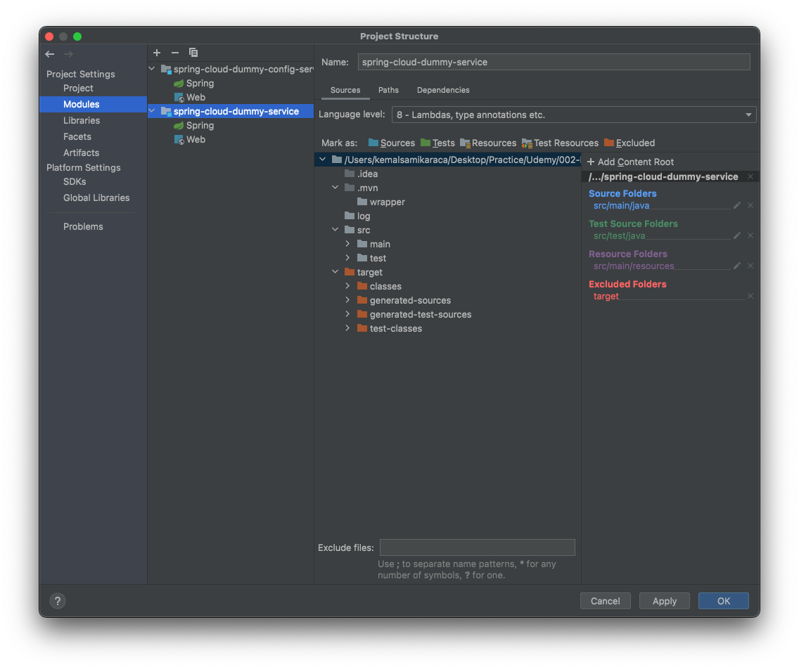
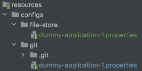

# Spring Boot - Java 8 Example

## İçindekiler

1. [Gereksinimler](#gereksinimler)
2. [Microservices](#microservices)
3. [Config Client Dependency](#config-client-dependency)
4. [Config Client](#config-client)
5. [Config Server Dependency](#config-server-dependency)
6. [Config Server](#config-server)
   1. [File Store](#file-store)
   2. [Git](#git)
7. [Config Server Property Sources](#config-server-property-sources)
8. [Kaynaklar](#kaynaklar)

## Gereksinimler

* Spring Web
* Spring Boot DevTools
* Actuator
* Config Client


## Microservices
Microservices mimarisi hakkındaki detaylı bilgi [https://microservices.io/](https://microservices.io/) adresinden alınabilir. Burada mikroservis mimarisinin, Spring uygulamalarda nasıl kullanılacağı konusunda durulacaktır.  

Öncelikle mikro servis mimarisinde uygulamaların bir çok küçük servisten oluştuğunu bilmeliyiz. Küçük uygulamaların bir şekilde yönetilmesi gerekir. Örneğin her servisin kendine özel ayarı `application.properties` altında bulunmaktadır. Uygulamaların kendine özel olan bu ayarları başka bir mikro servis olan Configuration Server ile yönetilebilir.    



Mikro servis mimarisi bundan çok daha karmaşık olmasına rağmen başlangıç olarak buna benzer bir yapı kurulacaktır.

Mikro servisleri ayarlarını Config Server üzerinden `git` ya da `file store` ile alacaklar.

## Config Client Dependency
Spring projesinin microservice mimarisine uygun olması için eklenmesi gereken tek dependency `config client`'dır.

Config Client kullanılabilmesi için proje oluşturulurken aşağıdaki gibi bağımlılığın eklenilmesi gerekmektedir.



Alternatif olarak maven projesi için `pom.xml` dosyasına aşağıdaki gibi `Config Client` bağımlılığı eklenir.
```xml
<dependency>
    <groupId>org.springframework.cloud</groupId>
    <artifactId>spring-cloud-starter-config</artifactId>
</dependency>
```

## Config Client
Normal bir Spring uygulamasının ayarları `application.properties` dosyası üzerinden yapılmaktadır. Ancak çok sayıda microservice mimarisinde olan Spring uygulamalarının yönetimi için ayarların yönetilmesi gerekmektedir.

`Config Server` üzerinden ayarların çekilmesi `Config Client` ile sağlanır. Aşağıdaki konfigürasyonda Config Server ayarlanmıştır.

*** NOT ***  
`Config Client` bazı ayarların yapılmasını ister. Bu ayarlar yapılmaması durumunda uygulama sunucusu açılmayabilir. `spring.config.import` ile Config Server tanımlanmalıdır.

*** NOT ***  
`spring.application.name` değeri ile spring uygulamasının adı belirlenir. Uygulamanın ismi Config Server'da dosya isimlerinde daha sonra kullanılacaktır. 

```properties
spring.application.name=dummy-application-1
spring.config.import=optional:configserver:http://localhost:8888
```


## @ConfigurationProperties
`@ConfigurationProperties` annotation ile application.properties dosyasından belirlediğimiz ayarlar alınabilir. `@Component` annotation da unutulmamalıdır.  


_Configuration.java_
```java
@Component
@ConfigurationProperties("dummy-service")
public class Configuration {

    private int minimum;
    private int maximum;
    // ...
}
```

_application.properties_
```properties
dummy-service.minimum=5
dummy-service.maximum=20
```


## Config Server Dependency
Microservice mimarisine göre uygulamalar birçok küçük servisten oluşmalıdır. `spring-cloud-dummy-service` bir modül olup aslında bir mikroservistir. Bu mikro servis içerisinde `Config Client` barındırmaktadır.   

Config Client'ların ayarlarını aldıkları `Config Server` olmalıdır. Örnek uygulamada `Config Client` ve `Config Server` iki farklı Spring projesidir.

Config Server modülü oluşturulurken aşağıdaki gibi bağımlılık eklenir.. 



Alternatif olarak maven projesi için `pom.xml` dosyasına aşağıdaki gibi `Config Server` bağımlılığı eklenir.
```xml
<dependency>
    <groupId>org.springframework.cloud</groupId>
    <artifactId>spring-cloud-config-server</artifactId>
</dependency>
```


## Config Server
`Config Server` ve `Config Client` mikroservisleri oluşturulduktan sonra projede artık 2 servis vardır. Projedeki modülleri aşağıdaki gibi görüntüleyebiliriz.




> _**File > New > "Module From Existing Sources ..."**_ ile projemize daha önceden oluşturduğumuz Spring projeleri modul olarak eklenebilir.


Uygulamanın `Config Server` olarak kullanılabilmesi için `@EnableConfigServer` annotation kullanılması gerekir.

```java
@EnableConfigServer
@SpringBootApplication
public class SpringCloudDummyConfigServerApplication {

    public static void main(String[] args) {
        SpringApplication.run(SpringCloudDummyConfigServerApplication.class, args);
    }

}
```

Config Clint içeren dummy servisinde Config Client için bazı ayarlar `application.properties` dosyasına eklenmişti. Orada olduğu gibi `Config Server` servisinde de bazı ayarların yapılması istenilmektedir. 

Örn. konfigürasyonların nereden alınacağının belirtilmesi zorunludur. Zaten Config Server olarak kullanılacaksa ve config dosyaları belirtilmemiş ise servisin Config Server olarak kullanılmasının bir anlamı yoktur.

Config Server, konfigürasyonları farklı yerlerden alabilir. Bunlar arasında en yaygın kullanılan git repository üzerinden alınmasıdır. 
- git
- file
- ...



### File Store
Örnek olarak öncelikle config dosyalarının `resources > configs` altından alınması üzerinde durulacaktır. 

Config Server içerisinde `resources > configs > file-store` dizini oluşturulup içerisinde `dummy-application-1.properties` gibi servislerin konfigürasyonları yerleştirilir. Dosya ismi ile ayarların hangi servise ait olduğu belirlenir. `dummy-application-1` adındaki mikro servis Config Server'dan ayarlarını almak istemesi durumunda Config Server `dummy-application-1.properties` dosyasını verecektir.   

Config Server servisinin diğer servis ayarlarını verirken git yerine bir dosya dizini kullanmak istiyorsa aşağıdaki değerleri `application.properties` dosyasına eklemelidir. 
```properties
spring.profiles.active=native
spring.cloud.config.server.native.search-locations=classpath:./configs/file-store
```

### Git
Config Server servisi konfigürasyonları `git` üzerinden de alabilmektedir. Bunun için öncelikle local git repository oluşturulması gerekir.

Config Server içerisinde `resource > configs > git` dizinine gidilerek (böyle bir dizini kendimiz oluşturduk) `git init` komutu ile repository oluşturulur.
```shell
git init
```

Yukarıdaki dosya dizini örneğinde olduğu gibi .git/ dizini ile aynı yere `dummy-application-1.properties` dosyası oluşturulur. 

```shell
git add .
git commit -m "dummy-application-1.properties service property added"
```

&#9888;&#9888; UYARI &#9888;&#9888;  
- `git commit` edilmemesi durumunda ayarlar Config Client servisini yansımayacaktır   
- `dummy-application-1.properties` dosyası `./git` dizini ile aynı yerde olmalıdır
- Değişiklikler yapıldıktan sonra önce Config Server daha sonra da Config Client servisi restart edilmelidir

_application.properties_ 
```properties
spring.cloud.config.server.git.uri=file:///Users/kemalsamikaraca/Desktop/Practice/Udemy/002-Microservices/001-Microservices-SpringCloud/spring-cloud-dummy-config-server/src/main/resources/configs/git
```

## Config Server Property Sources
Config Server mikro servisinin Config Client servisler için ayarları yapıldıktan sonra aşağıdaki link üzerinden servis bilgisine erişilebilir.

Örnek uygulamada Config Client için sadece `dummy-application-1` servisi bulunmaktadır. `spring.application.name` ile tanımlanan ve Config Server mikro servisini kullanan Config Client mikro servisleri aşağıdaki formatta çağrılabilirler. 
- http://localhost:8888/dummy-application-1/default 

## Kaynaklar

- https://microservices.io/
- https://spring.io/projects/spring-cloud
- https://cloud.spring.io/spring-cloud-config/reference/html/
- https://cloud.spring.io/spring-cloud-config/multi/multi__spring_cloud_config_client.html
- https://cloud.spring.io/spring-cloud-config/multi/multi__spring_cloud_config_server.html
- https://www.baeldung.com/spring-cloud-configuration