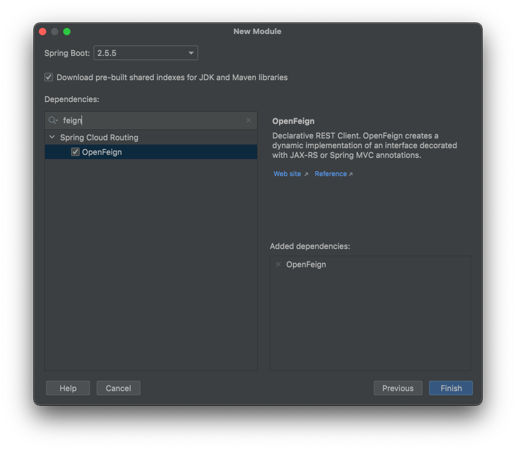

# Microservices - Spring Cloud 

## İçindekiler
1. [Gereksinimler](#gereksinimler)
2. [Rest Template](#rest-template)
3. [OpenFeign](#openfeign)
4. [How to include OpenFeign](#how-to-include-openfeign)
5. [FeignClient in Controller](#feignclient-in-controller)
6. [Kaynaklar](#kaynaklar)

## Gereksinimler
* Java 1.8
* Spring Boot 2.5.5
* Spring Web
* Spring Boot DevTools
* Actuator
* Config Client


## Rest Template
Herhangi ek bir kütüphane kullanılmadan Rest Template ile servisler arasında konuşma sağlanabilir.

Rest template kullanımında herhangi bir bağımlılık söz konusu değildir.

```java
@RestController
public class CurrencyConversionController {

    @GetMapping(path = "currency-conversion-rest-template/from/{fromCurrency}/to/{toCurrency}/quantity/{quantity}")
    public CurrencyConversion currencyConversionRestTemplate(@PathVariable String fromCurrency,
                                               @PathVariable String toCurrency,
                                               @PathVariable int quantity){

        String uri = "http://localhost:8081/currency-exchange/from/"+fromCurrency+"/to/"+toCurrency;
        RestTemplate restTemplate = new RestTemplate();
        ResponseEntity<CurrencyConversion> responseEntity = restTemplate.getForEntity( uri, CurrencyConversion.class);
        CurrencyConversion currencyConversion = responseEntity.getBody();
        return currencyConversion;
    }
}
```


## OpenFeign
Mikro servisler birbirleri ile HTTP istekleri üzerinden konuşurlar. Rest Template mikro servislerin birbiri ile konuşmasını sağlabilir. Ancak aynı kod parçalarını her yere tekrar tekrar yazmak sorun olabilmektedir.

`OpenFeign` ile servis isimleri kullanılacak direk url üzerinden servislerin birbirleri ile konuşması sağlanır.

OpenFeign kullanılabilmesi için proje oluşturulurken aşağıdaki gibi bağımlılığın eklenilmesi gerekmektedir.


Alternatif olarak maven projesi için `pom.xml` dosyasına aşağıdaki gibi `OpenFeign` bağımlılığı eklenir.
```xml
<dependency>
    <groupId>org.springframework.cloud</groupId>
    <artifactId>spring-cloud-starter-openfeign</artifactId>
</dependency>
```


## How to include OpenFeign
Bağımlılıklar eklendikten sonra kullanılacak mikro serviste aktifleştirilmesi gerekir.

- `@EnableFeignClients` : Feign etkinleştirilmesini sağlar 
- `@FeignClient` : Proxy (Feign Client) oluşturulmasını sağlar

```java
@EnableFeignClients
@SpringBootApplication
public class DummyApplication {
    // ...
}
```

Feign kullanımının amacı işlerin kolaylaştırılmasıdır. Mikro servisler için proxy oluşturularak servislerle konuşma sağlanır.
```java
@FeignClient(name="currency-exchange" , url = "localhost:8081")
public interface CurrencyExchangeProxy {

    @GetMapping(path = "currency-exchange/from/{fromCurrency}/to/{toCurrency}")
    public CurrencyConversion currencyExchange(@PathVariable String fromCurrency, @PathVariable String toCurrency);

}
```
- `@FeignClient(name="..."` değerinin çağrılan mikro servis ismi ile **_BAĞLANTISI YOKTUR_**. Bu değer, oluşturduğumuz CurrencyExchangeProxy (Feign Client) ismidir ve herhangi isim olabilir.
- `@FeignClient(url="..."` değeri ile mikro servisin  hangi url üzerinden çağrılacağı belirtilir


## FeignClient in Controller
`FeignClient`, proxy olarak oluşturulduktan sonra Controller içerisinde @Autowired ile oluşturularak kullanılabilir.

```java
@RestController
public class CurrencyConversionController {

    @Autowired
    private CurrencyExchangeProxy currencyExchangeProxy;

    // ...
    
    @GetMapping(path = "currency-conversion-feign/from/{fromCurrency}/to/{toCurrency}/quantity/{quantity}")
    public CurrencyConversion currencyConversionFeign(@PathVariable String fromCurrency,
                                                      @PathVariable String toCurrency,
                                                      @PathVariable int quantity){

        CurrencyConversion currencyConversion = currencyExchangeProxy.proxyCurrencyExchange(fromCurrency,toCurrency);
        return currencyConversion;
    }
    
}
```


## Kaynaklar
- https://docs.spring.io/spring-cloud-openfeign/docs/current/reference/html/
- https://github.com/spring-cloud-samples/feign-eureka
- https://cloud.spring.io/spring-cloud-netflix/multi/multi_spring-cloud-feign.html