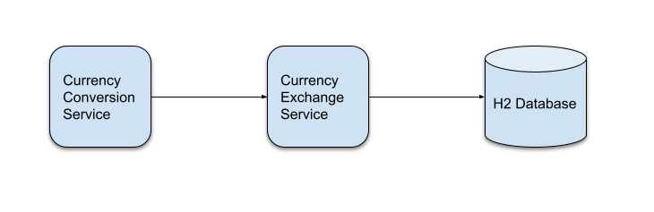
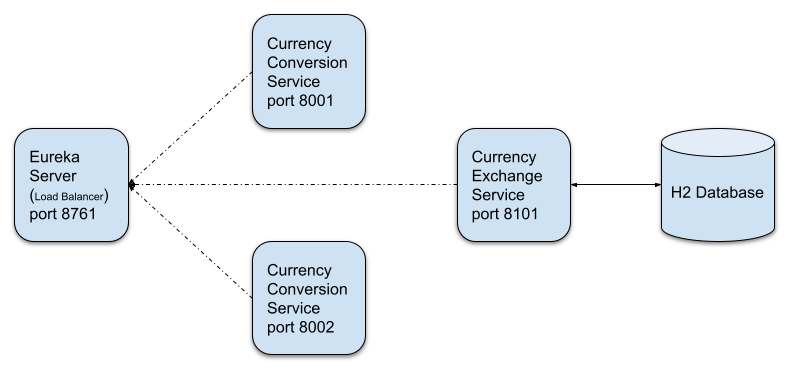
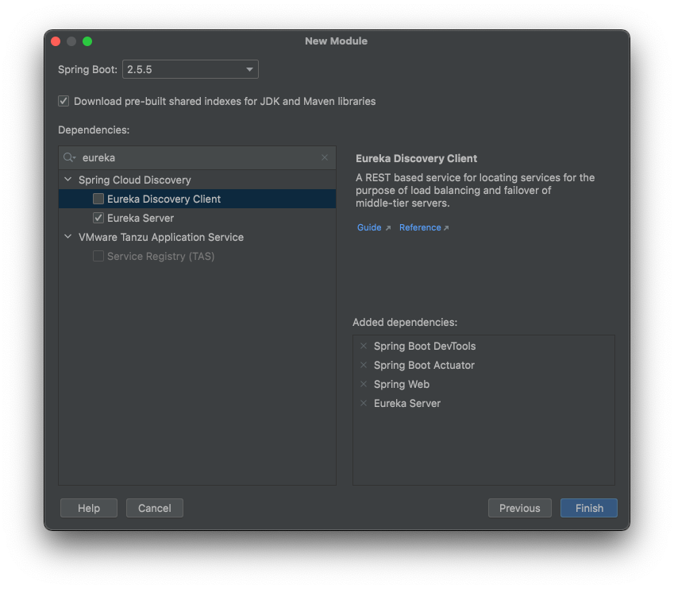
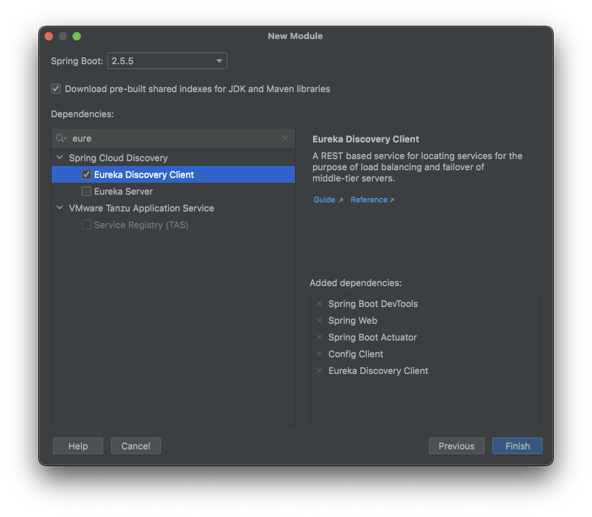

# Microservices - Spring Cloud 

## İçindekiler
1. [Gereksinimler](#gereksinimler)
2. [Servisler](#servisler)
3. [Naming Server Eureka](#naming-server-eureka)
4. [Eureka Discovery Client](#eureka-discovery-client)
5. [Kaynaklar](#kaynaklar)

## Gereksinimler
* Java 1.8
* Spring Boot 2.5.5
* Spring Web
* Spring Boot DevTools
* Actuator
* Eureka Server
* Eureka Client


## Servisler

Projenin genel yapısı aslında aşağıdaki gibidir. `Currency Exchange` servisi H2 veritabanı üzerinden verileri çekmektedir. `Currency Conversion` ise `Currency Exchange` servisinden aldığı verileri kullarak sayıya göre değer hesaplamaktadır. 


Her servisin tek olması ve toplam servis sayısının az olması durumunda bir sorun olmayacaktır. Ancak servis sayısı artması durumunda servis isimlerinin yönetilmesi gerekecektir.

Dolayısıyla projeye `naming server` eklenmesi ihtiyacı doğmuştur. Bu sayede bir servis diğer servisi eureka üzerinde tanımlı oldukları isimleriyle erişebilecekler.



## Naming Server Eureka

`Eureka server (naming server)` kullanılabilmesi için proje oluşturulurken aşağıdaki gibi bağımlılığın eklenilmesi gerekmektedir.


Alternatif olarak maven projesi için `pom.xml` dosyasına aşağıdaki gibi `Eureka server` bağımlılığı eklenir.
```xml
<dependency>
    <groupId>org.springframework.cloud</groupId>
    <artifactId>spring-cloud-starter-netflix-eureka-server</artifactId>
</dependency>
```

Eureka server için eksta bir ayar yapılması gerek yoktur. Mikro servisin adının ve portunun verilmesi yeterlidir.  

```properties
spring.application.name=eureka-naming-server
server.port=8761

# Eureka server kendine register olmaması için eklendi
# By default, the registry also tries to register itself, so you need to disable that behavior as well.
eureka.client.register-with-eureka=false
eureka.client.fetch-registry=false
```

Tabi Eureka server aktifleştirilmesi için `@EnableEurekaServer` annotation uygulamaya eklenmelidir.  
```java
@EnableEurekaServer
@SpringBootApplication
public class EurekaServerApplication {
    // ...
}
```

## Eureka Discovery Client
Bir servisin eureka server'a register olabilmesi için `Eureka Discovery Client` bağımlılığını eklemesi gerekmektedir.



Alternatif olarak maven projesi için `pom.xml` dosyasına aşağıdaki gibi `Eureka Client` bağımlılığı eklenir.
```xml
<dependency>
    <groupId>org.springframework.cloud</groupId>
    <artifactId>spring-cloud-starter-netflix-eureka-client</artifactId>
</dependency>
```

Eureka server'a eklenecek olan servis `application.properties` dosyasına aşağıdaki değer eklenir. Bu işlem ile servis, eureka server'a register olur.
```properties
# EUREKA SERVER
eureka.client.serviceUrl.defaultZone=http://localhost:8761/eureka
```


## Kaynaklar
- https://www.udemy.com/course/microservices-with-spring-boot-and-spring-cloud/learn/lecture/24346958#notes
- https://cloud.spring.io/spring-cloud-netflix/multi/multi_spring-cloud-eureka-server.html
- https://spring.io/guides/gs/service-registration-and-discovery/