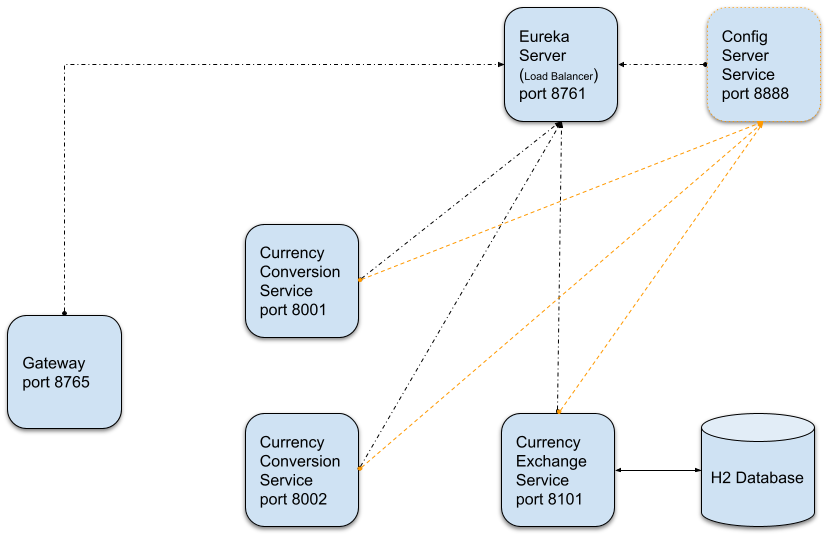
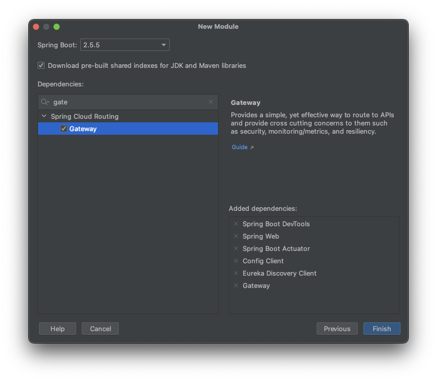
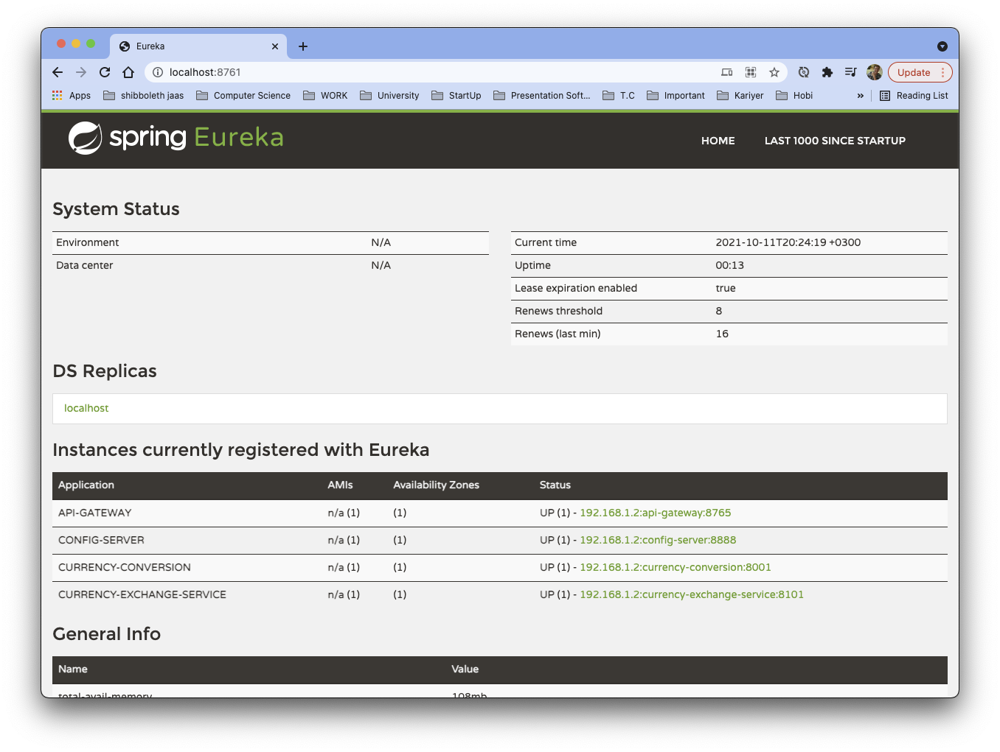

# Microservices - Spring Cloud 

## İçindekiler
1. [Gereksinimler](#gereksinimler)
2. [Uygulama Mimarisi](#uygulama-mimarisi)
3. [API-Gateway Dependency](#api-gateway-dependency)
4. [API-Gateway Usage](#api-gateway-usage)
5. [API-Gateway Advance](#api-gateway-advance)
6. [Kaynaklar](#kaynaklar)

## Gereksinimler
* Java 1.8
* Spring Boot 2.5.5


## Uygulama Mimarisi
Uyguluma mimarisine bakıldığında tüm servislerin `Eureka Server & Config Server`'a bağlı olduğu görülür.  

Daha önce bahsedildiği gibi,
- Eureka Server, servislerin birbirlerini isim (spring.application.name) ile tanımasını sağlar.
- Config Server ile tüm servislerin application.properties dosyalarının yönetilmesi sağlanır. 
- `API-Gateway` servisi ise gelen isteklerin ilgili servislere (Eureka Server yardımıyla) yönlendirilmesini sağlar.  



`API-GATEWAY` servisi ile otomatik olarak Eureka üzerinden `load balancer` özelliği sağlanmaktadır.

## API-Gateway Dependency
API-Gateway kullanılabilmesi için proje oluşturulurken aşağıdaki gibi bağımlılığın eklenilmesi gerekmektedir.


Alternatif olarak maven projesi için `pom.xml` dosyasına aşağıdaki gibi `API-Gateway` bağımlılığı eklenir.
```xml
<dependency>
    <groupId>org.springframework.cloud</groupId>
    <artifactId>spring-cloud-starter-gateway</artifactId>
</dependency>
```

`API-Gateway` aktifleştirilmesi için application.properties dosyası içerisine aşağıdaki değer eklenmelidir.
```properties
# SPRING CLOUD
spring.cloud.gateway.discovery.locator.enabled=true
```

??? spring.cloud.gateway.discovery.locator.enabled açıklanacak


## API-Gateway Usage
API-Gateway servisi Eureka Server'a register olduktan sonra Eureka arayüzünde aşağıdaki gibi görülmektedir. (Instances currently registered with Eureka)



API-Gateway üzerinden bir servis `localhost:8765/{spring.application.name}/...` formatında çağrılır.

_Örnek_ olarak aşağıdaki servislerden `CURRENCY-EXCHANGE-SERVICE` direk çağrılırken aynı servis `API-GATEWAY` üzerinden çağrılması bir altındaki linkteki gibidir.
- CURRENCY-EXCHANGE-SERVICE >> [http://localhost:8101/currency-exchange/from/USD/to/TR](http://localhost:8101/currency-exchange/from/USD/to/TR) 
- API-GATEWAY >> [http://localhost:8765/CURRENCY-EXCHANGE-SERVICE/currency-exchange/from/USD/to/TR](http://localhost:8765/CURRENCY-EXCHANGE-SERVICE/currency-exchange/from/USD/to/TR)


## API-Gateway Advance

??? Neden router a ihtiyacımız oldugunu anlatılacaktır.


## Kaynaklar
- https://cloud.spring.io/spring-cloud-gateway/multi/multi__configuration.html
- https://docs.spring.io/spring-cloud-gateway/docs/current/reference/html/
- https://spring.io/projects/spring-cloud
