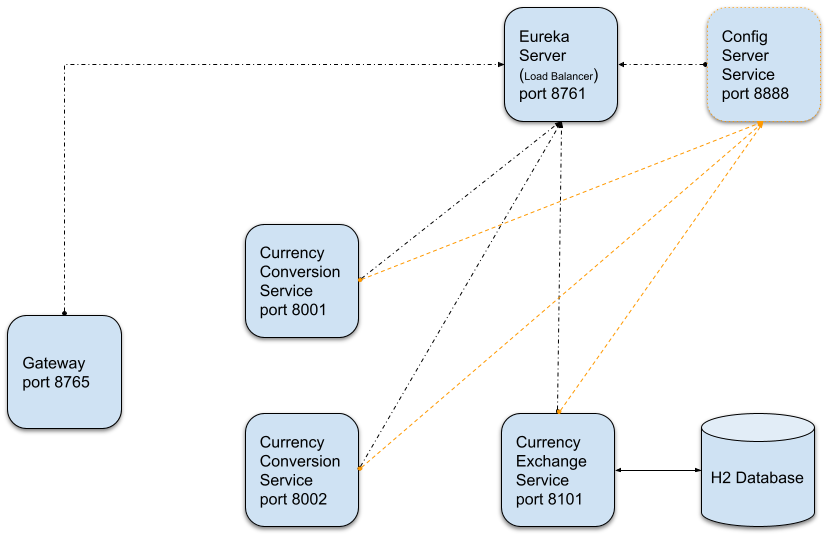
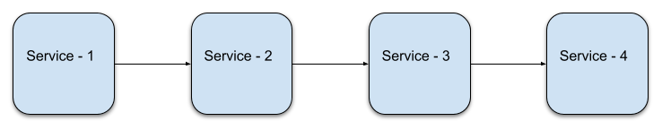

# Microservices - Spring Cloud 

## İçindekiler
1. [Gereksinimler](#gereksinimler)
2. [Uygulama Mimarisi](#uygulama-mimarisi)
3. [Circuit Breaker](#circuit-breaker)
4. [Circuit Breaker Desteklenen Uygulamalar](#circuit-breaker-desteklenen-uygulamalar)
5. [Kaynaklar](#kaynaklar)

## Gereksinimler
* Java 1.8
* Spring Boot 2.5.5

## Uygulama Mimarisi
Uyguluma mimarisine bakıldığında tüm servislerin `Eureka Server & Config Server`'a bağlı olduğu görülür.  

Daha önce bahsedildiği gibi,
- Eureka Server, servislerin birbirlerini isim (spring.application.name) ile tanımasını sağlar.
- Config Server ile tüm servislerin application.properties dosyalarının yönetilmesi sağlanır. 
- `API-Gateway` servisi ise gelen isteklerin ilgili servislere (Eureka Server yardımıyla) yönlendirilmesini sağlar.  

`API-GATEWAY` servisi ile otomatik olarak Eureka üzerinden `load balancer` özelliği sağlanmaktadır.

## Circuit Breaker
Uygulama mimarisinde, `Currency Conversion Service` değerlerini `Currency Exchange Service`'ten almaktadır. Mikro servis bağımlılıkları örnek proje mimarisinden çok daha fazla olabilir.

Örneğin aşağıdaki gibi servislerin bağımlılıkları olsun. Örnekteki yapıda `Service-3` ya da `Servise-4`'te yaşanabilecek aksaklıklar tüm zinciri etkileyeceklerdir. 

Bahsedilen senaryodaki problemi çözebilmek için,
- Servis down durumunda ise default response dönülebilir mi?
- Circuit Breaker pattern kullanılarak servis yoğunluğu azaltılabilir mi? (servis yükü fazla olan servisin)
- Servisin geçici hata vermesi durumunda istek tekrar edilebilir mi?
- Servislerin kullanımını (`rate limiting`) sınırlanabilir mi? 

## Circuit Breaker Desteklenen Uygulamalar 
- Netflix Hystrix
- Resilience4j
- Sentinel
- Spring Retry

## Kaynaklar
- https://spring.io/projects/spring-cloud
- https://spring.io/projects/spring-cloud-circuitbreaker
