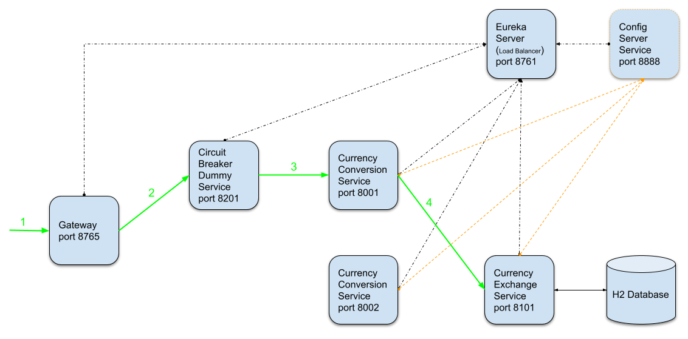
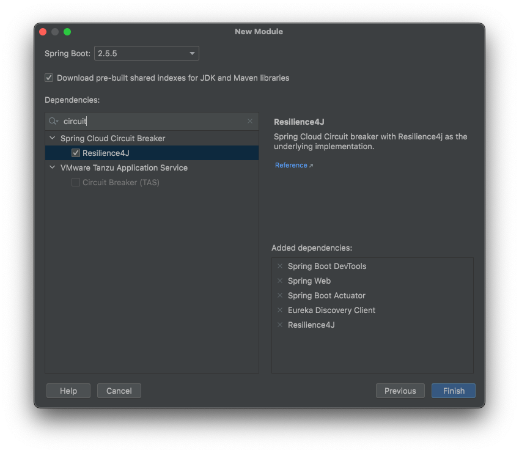

# Microservices - Spring Cloud 

## İçindekiler
1. [Gereksinimler](#gereksinimler)
2. [Uygulama Mimarisi](#uygulama-mimarisi)
3. [Circuit Breaker](#circuit-breaker)
4. [Circuit Breaker Desteklenen Uygulamalar](#circuit-breaker-desteklenen-uygulamalar)
5. [Resilience4j](#resilience4j)
6. [Resilience4j Annotations](#resilience4j-annotations)
7. [Kaynaklar](#kaynaklar)

## Gereksinimler
* Java 1.8
* Spring Boot 2.5.5
* Actuator
* Resilience4j
* AOP


## Uygulama Mimarisi
Uyguluma mimarisine bakıldığında tüm servislerin `Eureka Server & Config Server`'a bağlı olduğu görülür.  

Daha önce bahsedildiği gibi,
- Eureka Server, servislerin birbirlerini isim (spring.application.name) ile tanımasını sağlar.
- Config Server ile tüm servislerin application.properties dosyalarının yönetilmesi sağlanır. 
- `API-Gateway` servisi ise gelen isteklerin ilgili servislere (Eureka Server yardımıyla) yönlendirilmesini sağlar.  


`API-GATEWAY` servisi ile otomatik olarak Eureka üzerinden `load balancer` özelliği sağlanmaktadır.

`Circuit Breaker` yapısını test edilebilmesi için aşağıdaki gibi örnek bir `Circuit Breaker Dummy` Service oluşturulmuştur.


Üzerinde durulacak mimari ile alakalı senaryoda, `Currency Conversion Service` mikro servisinde problem olması üzerinde durulacaktır. 

API-Gateway üzerinden `Circuit Breaker Dummy Service`'i çağırılacaktır.    


## Circuit Breaker
Uygulama mimarisinde, `Currency Conversion Service` değerlerini `Currency Exchange Service`'ten almaktadır. Mikro servis bağımlılıkları örnek proje mimarisinden çok daha fazla olabilir.

Örneğin aşağıdaki gibi servislerin bağımlılıkları olsun. Örnekteki yapıda `Service-3` ya da `Servise-4`'te yaşanabilecek aksaklıklar tüm zinciri etkileyeceklerdir. 


Bahsedilen senaryodaki problemi çözebilmek için,
- Servis down durumunda ise default response dönülebilir mi?
- Circuit Breaker pattern kullanılarak servis yoğunluğu azaltılabilir mi? (servis yükü fazla olan servisin)
- Servisin geçici hata vermesi durumunda istek tekrar edilebilir mi?
- Servislerin kullanımını (`rate limiting`) sınırlanabilir mi? 


## Circuit Breaker Desteklenen Uygulamalar
- Resilience4j
- Netflix Hystrix
- Sentinel
- Spring Retry


## Resilience4j
`Circuit Breaker` kullanılabilmesi için proje oluşturulurken aşağıdaki gibi bağımlılığın eklenilmesi gerekmektedir.


Alternatif olarak maven projesi için `pom.xml` dosyasına aşağıdaki gibi `Resilience4j` bağımlılığı eklenir.
```xml
<dependency>
    <groupId>org.springframework.cloud</groupId>
    <artifactId>spring-cloud-starter-circuitbreaker-resilience4j</artifactId>
</dependency>
```

Resilience Circuit Breaker için aşağıki ayarlar yapılabilir.
```properties
spring.application.name=resilience-circuit-breaker
server.port=8201
```


## Resilience4j Annotations
Circuit Breaker için kullanılan annotation'lardan bazıları aşağıdakilerdir.
- @Retry

```java
@RestController
@RequestMapping(path = "circuit-breaker")
public class CircuitBreakerController {

    @Autowired
    private CurrencyConversionProxy currencyConversionProxy;

    private Logger logger = LoggerFactory.getLogger(CircuitBreakerController.class);

    @GetMapping(path = "/test")
    @Retry(name = "CircuitBreakerRetryName")
    public CurrencyConversion getRetryExampleRequest(){

        logger.info("TEST Called");

        // Request call with Feign but there is no such url and it will 404 not found
        CurrencyConversion currencyConversion = currencyConversionProxy.getCurrencyConversionDummy();
        return currencyConversion;
    }
}
```

Kod içerisinde kullanılan `@Retry(name = "CircuitBreakerRetryName")` satırı ile @Retry annotation için isimlendirme yapılmaktadır. `CircuitBreakerRetryName` değerini kullanarak bu fonksiyon için daha farklı ayarlar yapılabilir.
```properties
resilience4j.retry.instances.CircuitBreakerRetryName.max-attempts=5
resilience4j.retry.instances.CircuitBreakerRetryName.wait-duration=1s
```

Circuit Breaker özelliklerinden bir diğeri de sonuç dönemeyecek durumda ise default bir sonucun dönmesidir. 
Yukarıdaki örnekte Circuit Breaker kullanılan servis 5 kez 1 saniye aralıklarla işlemini yapmaya çalışmaktadır. 
Ancak tüm bu isteklerin sonucunda işlemin halen gerçekleştirilememesinde ne dönüleceği belirtilmemiştir.

```java
@RestController
@RequestMapping(path = "circuit-breaker")
public class CircuitBreakerController {

    @Autowired
    private CurrencyConversionProxy currencyConversionProxy;

    private Logger logger = LoggerFactory.getLogger(CircuitBreakerController.class);

    @GetMapping(path = "/test")
    @Retry(name = "CircuitBreakerRetryName", fallbackMethod = "defaultReturn")
    public CurrencyConversion getRetryExampleRequest(){

        logger.info("TEST Called");

        // Request call with Feign but there is no such url and it will 404 not found
        CurrencyConversion currencyConversion = currencyConversionProxy.getCurrencyConversionDummy();
        return currencyConversion;
    }
    
    public CurrencyConversion defaultReturn(Exception ex){
        CurrencyConversion currencyConversion = new CurrencyConversion();
        return currencyConversion;
    }
}
```

`@Retry` parametrelerinden `fallbackMethod` değeri ile işlemlerin hatalı olması durumunda hangi fonksiyonun çalıştırılacağı belirtilmektedir.

**_DİKKAT!!!_**   
`defaultReturn()` methodunun parametre olarak `Exception` aldığına dikkat edilmelidir.


## Kaynaklar
- https://spring.io/projects/spring-cloud
- https://spring.io/projects/spring-cloud-circuitbreaker
- https://resilience4j.readme.io/docs/retry
