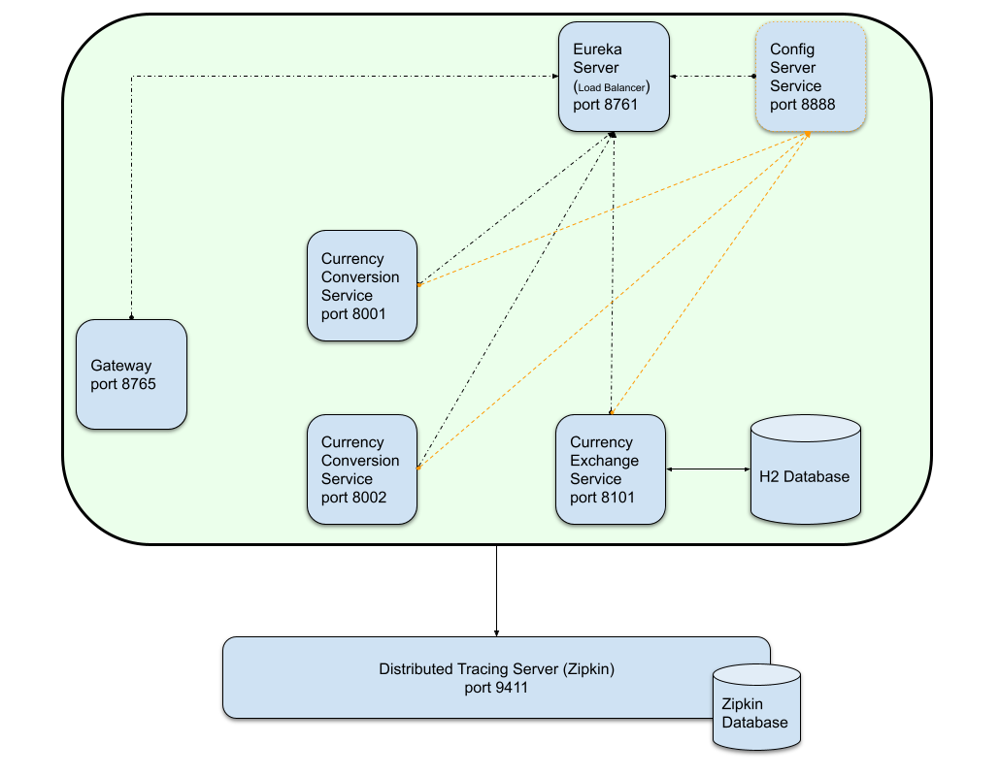
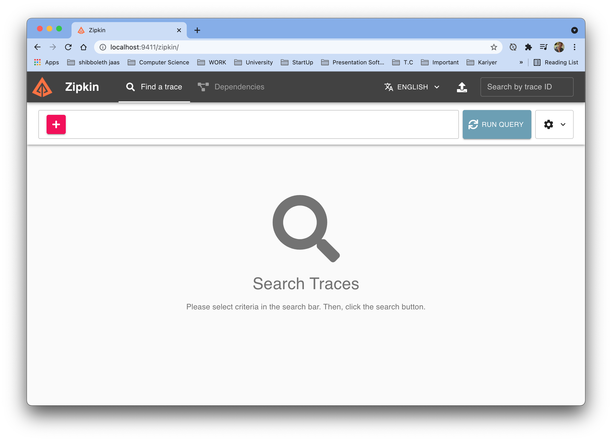
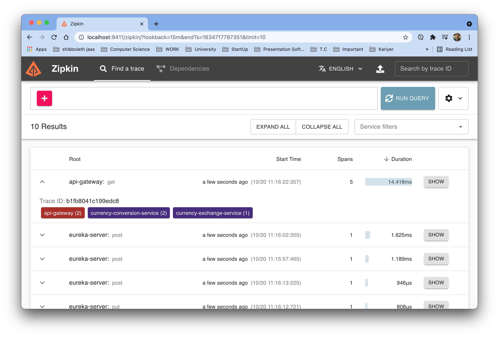
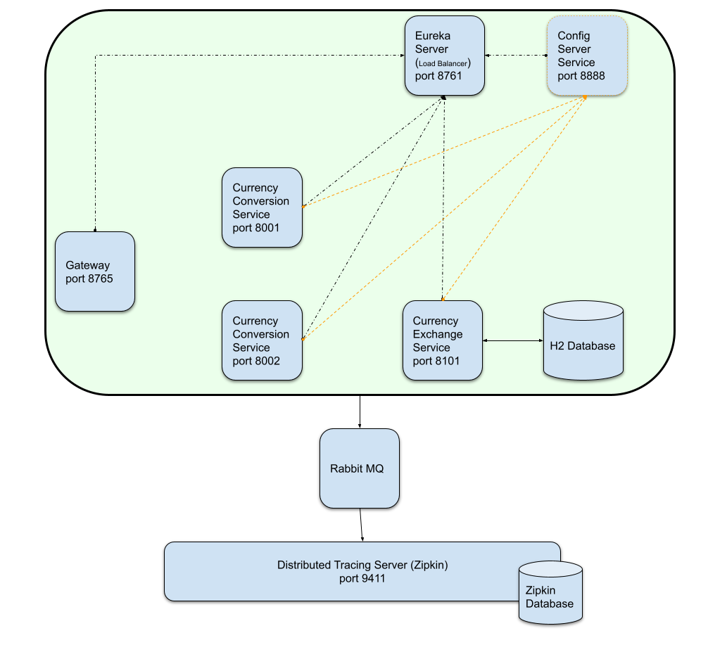

# Microservices - Spring Cloud 

## İçindekiler
1. [Gereksinimler](#gereksinimler)
2. [Distributed Tracing](#distributed-tracing)
3. [Zipkin](#zipkin)
4. [Sleuth](#sleuth)
5. [Kaynaklar](#kaynaklar)


## Gereksinimler
* Java 11
* Spring Boot 2.5.5
* Zipkin
* Sleuth

## Distributed Tracing
`Distributed tracing`, modern uygulama ortamlarını çalıştırmak ve izlemek için kullanılan yapı olarak adlandırılabilir.

Uygulamanın gelişmesi ile ortamda mikro servislerin sayısı artmaktadır. Bu servislerin bir şekilde takip edilebilmesi gerekitr. `Distributed tracing`, mikro servislerin birbirleri ile olan etkileşimlerin takip edilmesi ve izlenmesi olarak düşünülebilir.

## Zipkin
`Zipkin` bir çeşit `Distributed tracing server`'dır. Zipkin sonrası uygulama mimarisi aşağıdaki gibi olacaktır.


Zipkin docker container kullanılabilmesi için aşağıdaki komut çağrılır. Docker otomatik olarak ilgili image'i indirir ve container'ı ayağa kaldırır. 
```shell
docker run --name zipkin -p 9411:9411 -d openzipkin/zipkin
```

Zipkin container çalıştıktan sonra aşağıdaki gibi bir arayüz ile karşılaşılır.

Arayüzde görüldüğü üzere herhangi bir servis bulunmamaktadır. Mikro servislerin uygulama mimarisinde olduğu gibi zipkin'e kayıt olması `Sleuth` ile sağlanır.


## Sleuth 
Mikro servislerin `Distributed Tracing` yapısına dahil olması `Sleuth` ile sağlanır. Bu sebepten mikro servislere `Sleuth` bağımlılığı eklenmelidir.

```xml
<dependency>
    <groupId>org.springframework.cloud</groupId>
    <artifactId>spring-cloud-starter-sleuth</artifactId>
</dependency>
<dependency>
    <groupId>org.springframework.cloud</groupId>
    <artifactId>spring-cloud-sleuth-zipkin</artifactId>
</dependency>
```

`application.properties` dosyasında aşağıdaki değer eklenerek servisleri hangi sıklıkta izleneceği ayarlanabilir. (Örn. her 10 istekten 1i gibi) 
```properties
spring.sleuth.sampler.probability=0.1
```

`Development` ortamında bu değer 1'e yakın olurken `Production` ortamında bu değerin daha aşağılarda olmasında yarar vardır.

Zipkin ve Sleuth bağımlılıkları eklenip mikro servisler tekrar başlatılmasıyla Zipkin arayüzünde servis hareketleri gözükecektir.
`Run Query` butonu çalıştırılacak güncel hareketler görüntülenir.


> &#9888; Servislerde herhangi bir ayar yapmadan, sadece Sleuth bağımlılığı eklenerek ve Distributed Tracing Server ayağa kaldırılarak nasıl servislerin takip edilmesi sağlandı ?

**_ÇÜNKÜ_** zipkin default ayarlarında `spring.zipkin.baseUrl=http://localhost:9411` bulunmaktadır 

## ????? Rabbit MQ
Distributed Tracing Server üzerinde herhangi bir sorun olması durumunda takip etme işleminin devam etmesi için araya `Rabbit MQ` konulmasında yarar vardır.


```properties
<dependency>
    <groupId>org.springframework.amqp</groupId>
    <artifactId>spring-rabbit</artifactId>
</dependency>
```

## Linkler 
- http://localhost:8101/currency-exchange/from/USD/to/TRY
- http://localhost:8001/currency-conversion/feign/from/USD/to/TRY/quantity/4
- http://localhost:8001/currency-conversion/rest/from/USD/to/TRY/quantity/4
- http://localhost:8765/currency-conversion/feign/from/USD/to/TRY/quantity/4
- http://localhost:8765/currency-exchange/from/USD/to/TRY

## Kaynaklar
- https://hub.docker.com/r/openzipkin/zipkin/
- https://spring.io/projects/spring-cloud-sleuth
