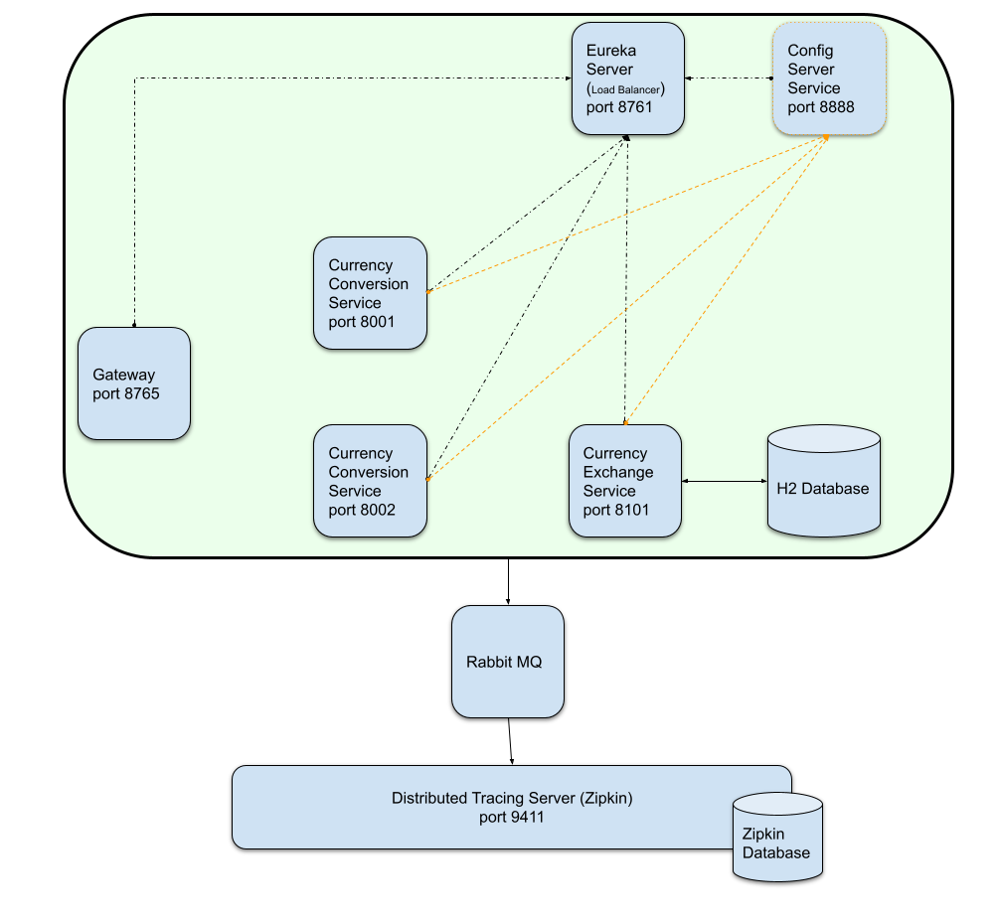

# Microservices - Spring Cloud 

## İçindekiler
1. [Gereksinimler](#gereksinimler)
2. [Message Queue](#message-queue)
3. [Rabbit MQ](#rabbit-mq)
4. [Rabbit MQ Dependency](#rabbit-mq-dependency)
5. [Docker Compose](#docker-compose)
6. [Kaynaklar](#kaynaklar)

## Gereksinimler
* Java 1.8
* Spring Boot 2.5.5
* Docker 
* Docker Rabbit MQ Image


## Message Queue
Kullanılan baze message queue'lar;

- Rabbit MQ
- Kafka
- ActiveMQ


## Rabbit MQ
`Distributed tracing` ile mikro servisler takip edilebilmektedir ve server olarak `Zipkin` kullanılmaktadır.
Zipkin server down olması durumlarında takibin devam edebilmesi için uygulama mimarisine `Rabbit MQ` eklenmelidir. 




## Rabbit MQ Dependency
Uygulama mimarisinde görüldüğü üzere tüm mikro servisler doğrudan zipkin yerine Rabbit MQ ile konuşacaklarından ilgili bağımlılık (dependency) mikro servis modüllere eklenmelidir.

```xml
<dependency>
    <groupId>org.springframework.amqp</groupId>
    <artifactId>spring-rabbit</artifactId>
</dependency>
```

Rabbit MQ dependeny eklendikten sonra mikro servislerin `application.properties` dosyasında aşağıdaki gibi ayarlama yapılır.
Mikro servislere Rabbit MQ üzerinden Zipkin'e rapor yollanması sağlanmış olur.
```properties
spring.zipkin.sender.type=rabbit
```

## Docker Compose
Uygulama docker-compose ile çalıştığından eklenilen yeni container ile bazı değişiklikler yapılması gerekir.

- Mikro servislere `Rabbit MQ` bağımlılığı eklendiğinden ve `application.properties` üzerinde değişiklik yapıldığından yeni image oluşturulmalıdır
- docker-compose.yml içerisinde Rabbit MQ url değeri girilmelidir.


## Kaynaklar
- https://www.udemy.com/course/microservices-with-spring-boot-and-spring-cloud/learn/lecture/24346746
- https://spring.io/projects/spring-cloud
- https://spring.io/guides/gs/messaging-rabbitmq/
- https://www.rabbitmq.com/tutorials/tutorial-one-spring-amqp.html

