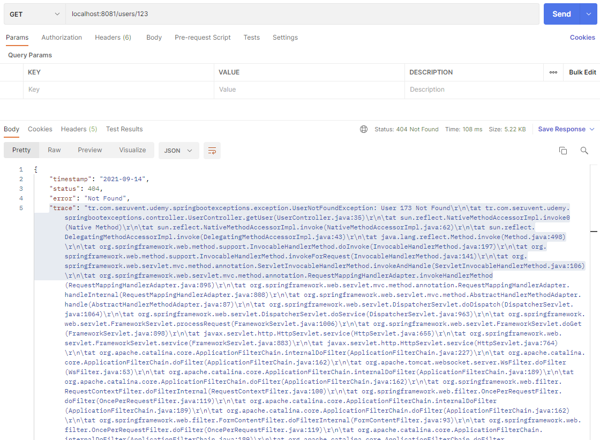

# Spring Boot - Java 8 Example


## İçindekiler
1. [Gereksinimler](#gereksinimler)
2. [Response](#response)
3. [ResponseEntity](#responseentity)
4. [@ResponseStatus](#responsestatus)
5. [Trace Error Message](#error-message-trace)
6. [Annotations](#annotations)
7. [Kaynaklar](#kaynaklar)
	

## Gereksinimler
 * Spring Web
 * Spring Boot DevTools


## Response  
Sunucuya gelen isteklere(`request`) doğru cevaplar(`response`) dönülmelidir. 

Örneğin sunucudan bir kullanıcı bilgisi istenildiğinde eğer kullanıcı bilgisi, istek yapan müşteriye veriliyorsa işlem başarılır ve `200 http status code` dönülür. 

Diğer bir durumda ise olmayan bir kullanıcı talep edilebilir. Bu durumda sunucu, kullanıcı bilgisini veremeyeceğinden `404 status code` ile istek yapan taraf bilgilendirilebilir.

Bunlara ek olarak müşteri klasik bir `post` işlemi gerçekleştirebilir. Bunun anlamı dönen cevabın(`response`) içeriğine gerek olmayıp, post işleminin gerçekleşip gerçekleşmediğini belirten bir durum kodu (`201 status code`) dönülmesi yeterli olacaktır.

Örneklerde olduğu gibi isteklere verilen cevaplar yönetilmelidir. 
- ResponseEntity
- @ResponseStatus / @ResponseCode
- Custom Exception 


## ResponseEntity
Gelen isteklere herhangi bir obje döndüğümüzde Spring o objeyi otomatik olarak JSON formatına çevirir ve `200 http status code` döner. Ancak bazı senaryolarda status code değeri farklı olmalıdır. 

Response olarak dönen içeriğin `http status code` değerleri `ResponseEntity` ile sağlanır.

ResponseEntity class'ı ile içeriğin(content) ve durum kodunun dönülmesi sağlanır.

> Response header status code değerine dikkat edilmedi gerekir.  
> 
> Örn. ResponseEntity.created() ile `201` durum kodu dönerken ResponseEntity.ok() ile `200` durum kodu dönmektedir.

```java
@RestController
public class UserController {

    @PostMapping(path = "users")
    public ResponseEntity saveUser(@RequestBody User user){
        userService.saveUser(user);

        URI location = ServletUriComponentsBuilder
                                .fromCurrentRequestUri()
                                .path("/id/{user.id}")
                                .buildAndExpand(user.getId())
                                .toUri();

        return ResponseEntity.created(location).build();
    }
}
```

Aslında ResponseEntity kullanarak istediğimiz `status code` ve `content` ile isteklere cevap verebiliriz. Ancak her fonksiyonun içerisine ResponseEntity yazılması pek mantıklı değil.

```java
    @GetMapping(path = "/users/param")
    public ResponseEntity getUserWithParam(@RequestParam int id){
        User user = userService.findUser(id);
        return ResponseEntity.ok(user);
    }
```


## @ResponseStatus

`@ResponseStatus` annotation ile dönecek olan objenin http status code değerini istediğimiz şekilde düzenleyebiliriz.

`@ResponseStatus` annotation olmaması durumunda default olarak Spring exception'lar için `500 status code` dönmektedir.

**_Peki bu annotation nasıl kullanışlı hale getirilir ???_**  
Kendi Exception class'ımızı yazarak daha kullanışlı hale getirebilir. Oluşturacağımız Exception class için sabit `status code` değeri tanımlayabiliriz.

```java
@ResponseStatus(HttpStatus.NOT_FOUND)
public class UserNotFoundException extends RuntimeException {
    public UserNotFoundException(String msg){
        super(msg);
    }

}
```

`@ResponseStatus` annotation tanımlamasına baktığımızda `TYPE` ve `METHOD` olarak kullanılabildiği görülmektedir. Bunun anlamı `@ResponseStatus` annotation class tanımlamalarından ve fonsiyonlardan önce kullanılabilir. 

```java
@java.lang.annotation.Target({java.lang.annotation.ElementType.TYPE, java.lang.annotation.ElementType.METHOD})
// ...
public @interface ResponseStatus {
    // ... 
}
```


## Error Message (Trace)
Aşağıdaki kod parçasında kullanıcı bulunmaması durumunda UserNotFoundException hatası atacaktır.   

```java
@RestController
public class UserController {
    
    // ...
    
    @GetMapping(path = "/users/{id}")
    public User getUser(@PathVariable int id){
        User user = userService.findUser(id);

        // UserNotFoundException
        if(user==null)
            throw new UserNotFoundException(String.format("User %o Not Found" , id));

        return user;
    }
    
    // ...

}
```

Spring default olarak Exception durumlarında `trace` değerini de dönmektedir(ayrıca 500 status code döner). Bu değer kullanıcı dostu olmadığından response içeriğinden kaldırılabilir. 



application.properties dosyasına aşağıdaki parametre eklenerek `trace` değeri kaldırılır.
```properties
server.error.include-stacktrace=never
```

## Annotations
Spring framework'te kullanılan annotation'ları genel olarak aşağıdaki gibi sınıflandırabiliriz.

- @SpringBootApplication
- @RestController
- @RequestMapping / @GetMapping / @PostMapping
- @ResponseStatus / @ResponseCode / @ResponseEntity
- @PathVarible / @RequestBody / @RequestParam


## Kaynaklar
- https://spring.io/projects/spring-boot
- https://spring.io/blog/2013/11/01/exception-handling-in-spring-mvc 
- https://www.baeldung.com/exception-handling-for-rest-with-spring

