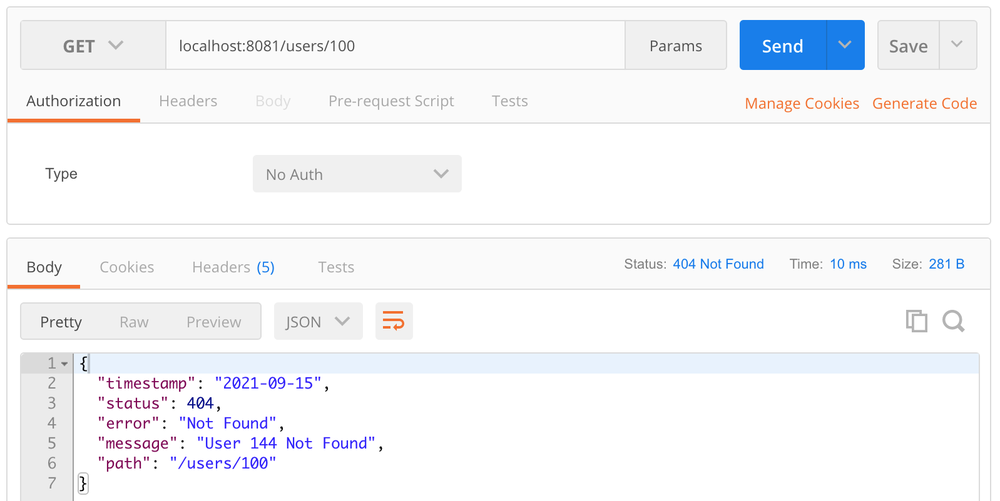

# Spring Boot - Java 8 Example


## İçindekiler
1. [Gereksinimler](#gereksinimler)
2. [Advanced Exception Handling](#advanced-exception-handling)
3. [Kaynaklar](#kaynaklar)
	

## Gereksinimler
 * Spring Web
 * Spring Boot DevTools


## Advanced Exception Handling

@ResponseStatus kullanarak oluşturduğumuz UserNotFoundException class'ının response olarak dönmesi durumunda resimdeki değerler gelir. Spring default olarak `timestamp`, `status` ve `path` gibi değerleri atamıştır.  



**_Peki timestamp, status gibi Spring tarafından otomatik olarak verilen bu değerlerin isimlerini nasıl değiştirilir ???_**
 
Custom Exception alanları yaratmak için `ResponseEntityExceptionHandler` class'ı ve `@ControllerAdvice` annotation'dan yararlanılır.

```java
@ControllerAdvice
public class CustomResponseEntityExceptionHandler extends ResponseEntityExceptionHandler {
    // ..
    @ExceptionHandler(NullPointerException.class)
    public ResponseEntity customExceptionHandler(){
        return ResponseEntity.status(HttpStatus.NOT_FOUND).body(new CustomException(new Date(),"my message" , "CustomResponseEntityExceptionHandler.customExceptionHandler()"));
    }
    // ..
}
```
Yukarıdaki kod parçasında `@ExceptionHandler` ile belirtilen Throwable class'ların çağrılması durumunda hemen altındaki fonksiyonun çalıştırılacağı belirtilmektedir. Bu fonksiyonun ile dönecek olan http status code ve body istenilen şekilde değiştirilir.

`@ControllerAdvice` ile ne yapıldığı araştırılacak? 


#### UYARI-1

Aşağıdaki gibi `myCustomField` eklenerek response değiştirilmeye çalışılsada `myCustomField` response içerisinde gözükmeyecektir. 

```java
@ResponseStatus(HttpStatus.NOT_FOUND)
public class UserNotFoundException extends RuntimeException{

    private String myCustomField;

    public UserNotFoundException(String msg){
        super(msg);
    }

    public UserNotFoundException(String message, String myCustomField) {
        super(message);
        this.myCustomField = myCustomField;
    }

    // ..
}
```


#### UYARI-2

Aşağıdaki kod parçalarında birinde `UserNotFoundException` dönerken diğerinde `RuntimeException` dönülmektedir. Aralarındaki tek fark `UserNotFoundException` oluşturulurken hangi `status code` değeri ile dönüleceği özelleştirilmiştir.

```java
@RestController
public class UserController {

    @Autowired
    private UserService userService;

    @GetMapping(path = "users/{id}")
    public User getUser(@PathVariable int id) {
        User user = userService.findUser(id);

        if (user == null)
            throw new UserNotFoundException("user id:" + id + " not found");

        return user;
    }
}
```

```java
@RestController
public class UserController {

    @Autowired
    private UserService userService;

    @GetMapping(path = "users/{id}")
    public User getUser(@PathVariable int id) {
        User user = userService.findUser(id);
        
        if(user==null)
            throw new RuntimeException("runtime example example");
        
        return user;
    }
}
```


## Kaynaklar
- https://spring.io/projects/spring-boot
- https://spring.io/blog/2013/11/01/exception-handling-in-spring-mvc 
- https://www.baeldung.com/exception-handling-for-rest-with-spring

