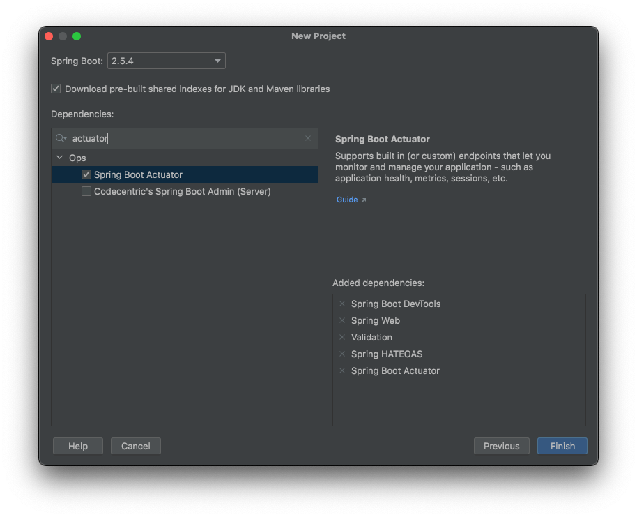

# Spring Boot - Java 8 Example


## İçindekiler
1. [Gereksinimler](#gereksinimler)
2. [Actuator](#actuator)
3. [Actuator Dependencies](#actuator-dependencies)
5. [Kaynaklar](#kaynaklar)
	

## Gereksinimler
 * Spring Web
 * Spring Boot DevTools
 * Validation
 * HATEOAS
 * Actuator


## Actuator
Spring Boot birçok özelliğe sahiptir. Bunlardan biri de uygulama `production` ortamına konulduğunda izlenmesi ve yönetilmesidir.


## Actuator Dependencies
Spring actuator özelliğinin kullanılabilmesi için proje oluşturulurken Ops başlığı altından `actuator` bağımlılığı eklenir.



Direk dependency olarak eklemek istiyorsak maven projesi için `pom.xml` dosyasına aşağıdaki gibi `actuator` bağımlılığı eklenir.
```xml
<dependencies>
    <dependency>
        <groupId>org.springframework.boot</groupId>
        <artifactId>spring-boot-starter-actuator</artifactId>
    </dependency>
    <!-- other dependecies -->
</dependencies>
```


## Actuator UI
Spring uygulamasına bağımlılık eklendikten sonra `/actuator` (localhost:8080/actuator) ile uygulama monitor edilebilir.


## Kaynaklar
- https://docs.spring.io/spring-boot/docs/current/reference/html/actuator.html
- https://spring.io/projects/spring-boot
- 
