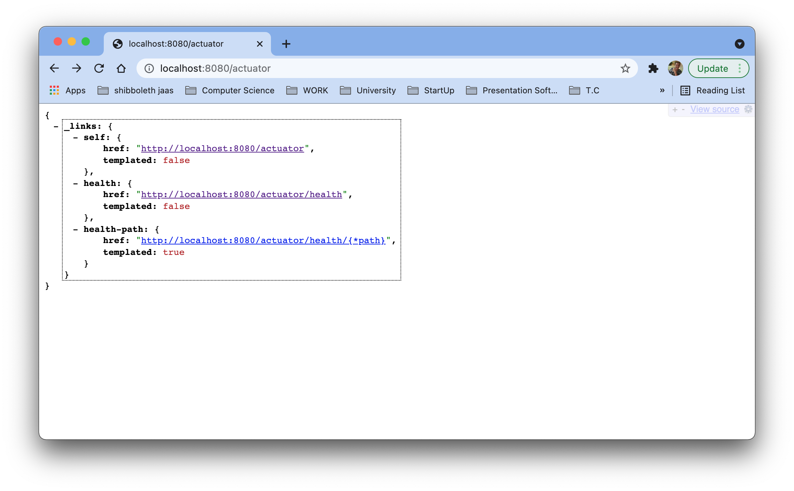
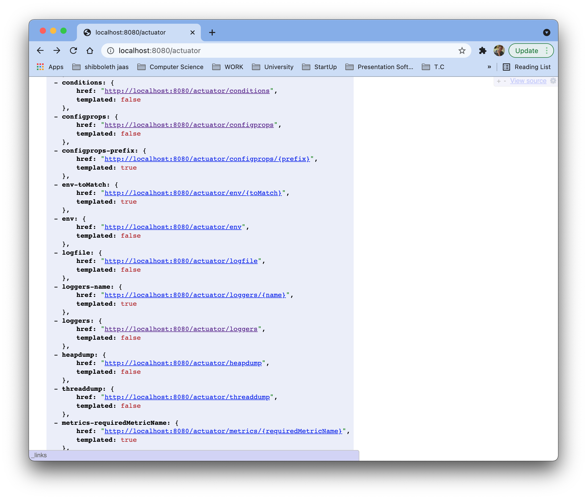

# Spring Boot - Java 8 Example


## İçindekiler
1. [Gereksinimler](#gereksinimler)
2. [Actuator](#actuator)
3. [Actuator Dependencies](#actuator-dependencies)
4. [Actuator HTTP Endpoints](#actuator-http-endpoints)
5. [Actuator Settings](#actuator-settings)
6. [Kaynaklar](#kaynaklar)
	

## Gereksinimler
 * Spring Web
 * Spring Boot DevTools
 * Validation
 * HATEOAS
 * Actuator


## Actuator
Spring Boot birçok özelliğe sahiptir. Uygulamanın `production` ortamına konulduğunda izlenmesi(monitor) ve yönetilmesi(manage) gerekir.

`Actuator` ile yönetme ve izleme için aşağıdakilerden biri kullanılabilir. 
- HTTP endpoints
- JMX (Java Management Extensions)

`Actuator` tarafından default olarak `HTTP endpoints` kullanılmaktadır.  


## Actuator Dependencies
Spring actuator özelliğinin kullanılabilmesi için proje oluşturulurken Ops başlığı altından `actuator` bağımlılığı eklenir.


Direk dependency olarak eklemek istiyorsak maven projesi için `pom.xml` dosyasına aşağıdaki gibi `actuator` bağımlılığı eklenir.
```xml
<dependencies>
    <dependency>
        <groupId>org.springframework.boot</groupId>
        <artifactId>spring-boot-starter-actuator</artifactId>
    </dependency>
    <!-- other dependecies -->
</dependencies>
```


## Actuator HTTP Endpoints
Spring uygulamasına bağımlılık eklendikten sonra `/actuator` (localhost:8080/actuator) ile uygulama monitor edilebilir.

- [http://localhost:8080/actuator](http://localhost:8080/actuator)




## Actuator Settings
`Actuator` üzerinden HTTP endpoints aracılığıyla uygulamanın durumu görüntülenebilir. Her endpoint ayrı ayrı `enable` ya da `disable` edilebilir.

Default olarak sadece `health` endpoint ([/actuator/health](/actuator/health)) gösterilmektedir.

Aşağıdaki ayar, `application.properties` dosyasına eklenerek default olarak tüm endpoint'ler enable edilebilir. 
```properties
management.endpoints.web.exposure.include=*
```




## Kaynaklar
- https://docs.spring.io/spring-boot/docs/current/reference/html/actuator.html
- https://spring.io/projects/spring-boot
- 
