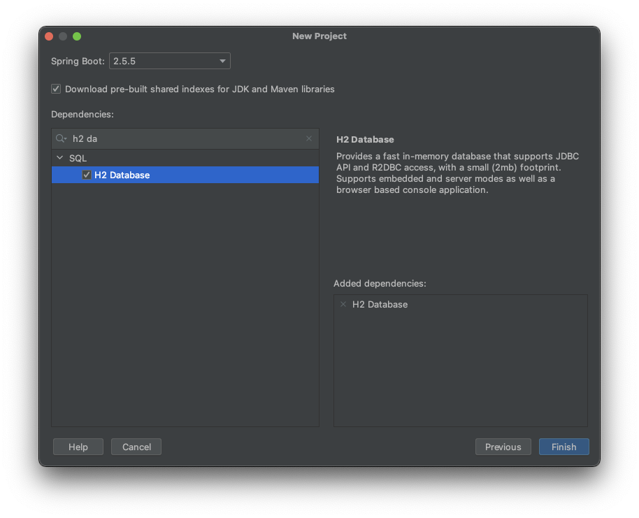
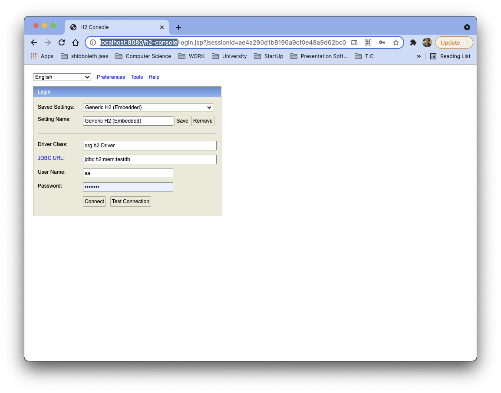
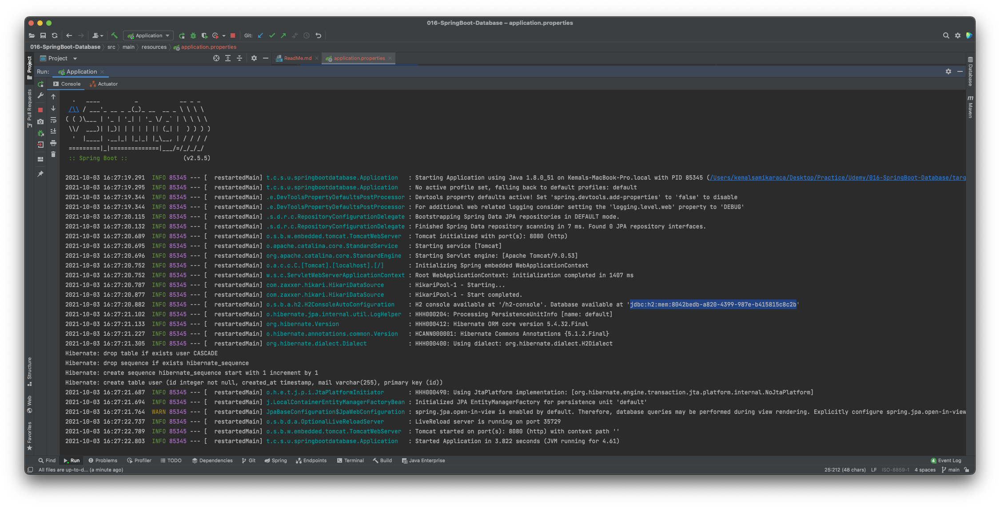
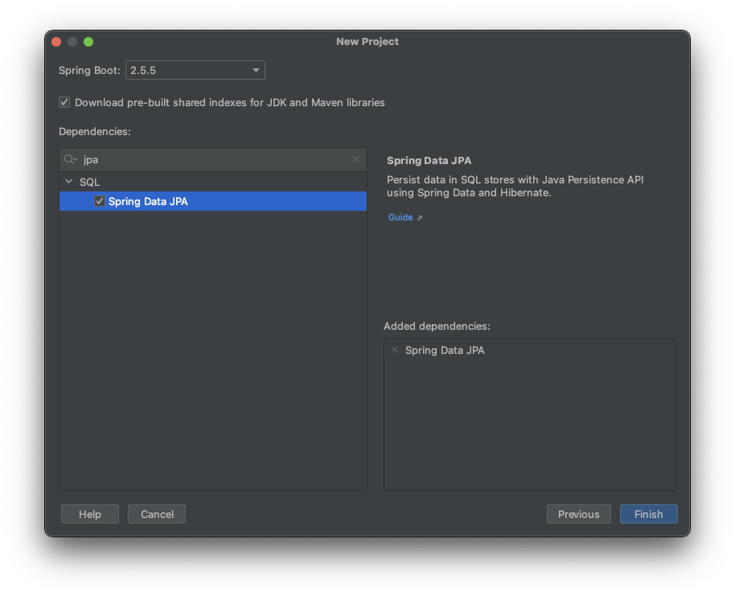

# Spring Boot - Java 8 Example

## İçindekiler

1. [Gereksinimler](#gereksinimler)
2. [Embedded H2 Database Dependency](#embedded-h2-database-dependency)
3. [Embedded H2 Database Properties](#embedded-h2-database-properties)
4. [data.sql](#datasql)
5. [JPA Dependency](#jpa-dependency)
6. [JPA](#jpa)
7. [JPARepository](#jparepository)
8. [Kaynaklar](#kaynaklar)

## Gereksinimler

* Spring Web
* Spring Boot DevTools
* Validation
* HATEOAS
* Actuator
* HAL Explorer
* Spring Security
* H2 Database
* Spring Data JPA


## Embedded H2 Database Dependency    
Spring Boot Web uygulaması default olarak gömülü(embedded) Apache Tomcat server üzerinde çalışmaktadır. Aynı şekilde Spring uygulamaların hızlı geliştirilebilmesi için embedded veritabanları kullanılabilmektedir.

`H2 Embedded Database` kullanımı için proje oluşturulurken aşağıdaki bağımlılığın eklenilmesi gerekmektedir. 



Alternatif olarak maven projesi için `pom.xml` dosyasına aşağıdaki gibi `H2 Embedded Database` bağımlılığı eklenir.

```xml
<dependency>
  <groupId>com.h2database</groupId>
  <artifactId>h2</artifactId>
  <scope>runtime</scope>
</dependency>
```


## Embedded H2 Database Properties
Embedded H2 Database uygulamaya eklendikten sonra arayüzden erişilebilmesi için application.properties dosyasına bazı değerlerin eklenmesi gerekir.

```properties
spring.h2.console.enabled=true
spring.h2.console.path=/h2-console
```

Yukarıdaki değerlerin eklenmesinden sonra uygulamada [http://localhost:8080/h2-console](http://localhost:8080/h2-console) üzerinden H2 Database arayüzüne erişilebilir.

> *** _UYARI_ ***  
> Bu aşamada H2 Database'e bağlanabilmemiz için `JDBC URL`, `Username` ve `Password` değerlerini bilmemekteyiz. 




H2 Database için `kullanıcı adı` ve `şifresi` aslında Spring Boot log'ların görülmektedir. Aşağıdaki örnekte olduğu gibi Spring her restart edilişinde yeni bir database oluşturmaktadır ve default olarak `sa` kullanıcı adı ile giriş yapılabilmektedir.




Aşağıdaki değerler eklenerek H2 Database için istediğimiz kullanıcı, şifre, database ve arayüz için path tanımlayabiliriz.
```properties
# DATABASE H2 Configuration
spring.h2.console.enabled=true
spring.h2.console.path=/h2-console
spring.datasource.url=jdbc:h2:mem:testdb
spring.datasource.username=sa
spring.datasource.password=password
spring.datasource.driverClassName=org.h2.Driver
```

## data.sql
Uygulamanın her restart edilmesi durumunda veritabanındaki tablolar `drop` edilip tekrardan oluşturulur. Bu sebepten tablolar içerisinde herhangi bir data bulunmamaktadır.

`data.sql` ile veritabanındaki tablolara veri eklenmesi sağlanır. (resources/data.sql) 

> Spring Boot 2.5 ve üzerindeki versionlarda data.sql çalışmasında sorun olmaktadır. Bu sorunun giderilmesi için `application.properties` dosyasına `spring.jpa.defer-datasource-initialization=true` eklenmelidir.
> 
> Spring Boot 2.4.4'te herhangi bir sorun ile karşılaşılmadan data.sql çalışmaktadır.

Sonuç olarak `application.properties` dosyası bu aşamada aşağıdaki gibi olmalıdır.

```properties
# DATABASE JPA Configuration
spring.jpa.defer-datasource-initialization=true
# DATABASE H2 Configuration
spring.h2.console.enabled=true
spring.h2.console.path=/h2-console
spring.datasource.url=jdbc:h2:mem:testdb
spring.datasource.username=sa
spring.datasource.password=password
spring.datasource.driverClassName=org.h2.Driver
```

## JPA Dependency
`JPA (Java Persistence API)`, Java sınıfları ile ilişkisel veritabanı tablolarını ilişkilendirmek için ortaya çıkmış bir standarttır.

Spring JPA özelliğinin kullanılabilmesi için proje oluşturulurken SQL başlığı altından `Spring Data JPA` bağımlılığı eklenir.



Alternatif olarak maven projesi için `pom.xml` dosyasına aşağıdaki gibi `Spring Data JPA` bağımlılığı eklenir.

```xml
<dependency>
    <groupId>org.springframework.boot</groupId>
    <artifactId>spring-boot-starter-data-jpa</artifactId>
</dependency>
```


## JPA
`JPA (Java Persistence API)`, Java sınıfları ile ilişkisel veritabanı tablolarını ilişkilendirmek için ortaya çıkmış bir standarttır. Spring projelerde oluşturulan model ile veritabanındaki tabloların ilişkilendirilmesi JPA ile sağlanmaktadır.

Java sınıflarının database tabloları ile ilişkilendirilmesi annotation (javax.persistence annotation'ları) ile sağlanır. Örnek bir ilişkilendirme için eklenmesi gereken annotation'lar aşağıdaki gibi olmalıdır.

```java
@Entity
public class User {

    @Id
    @GeneratedValue
    private int id;
    
    // other attributes

    public User() {}
    
    // getters , setters , constructors
}
```

- `@Entity` ile Java sınıfı ile veritabanı tablosu ilişkilendirilmesi sağlanır
  - `java.lang.annotation.ElementType.TYPE` olduğundan sınıflar için kullanılır
- `@Id` ile hangi field değerinin id olarak kullanılacağı belirtilir
  - `java.lang.annotation.ElementType.FIELD` olduğundan değişkenler için kullanılır
- `@GeneratedValue` ile hangi field değerinin veritabanı tarafından oluşturulacağı belirtilir
  - `java.lang.annotation.ElementType.FIELD` olduğundan değişkenler için kullanılır


## JPARepository
Daha önceki örneklerde repository olarak statik veriler kullanılmıştı. `JPARepository` extends edilerek datanın, veritabanından çekilmesi sağlanır.

Ayrıca JPARepository bazı fonksiyonları default olarak sağlamaktadır. 
- findAll()
- findById(int id)
- ...

Aşağıda extends edilen JPARepository örneği bulunmaktadır. Burada `interface` kullanıldığına dikkat edilmesi gerekir. 

```java
@Repository
public interface UserRepository extends JpaRepository<User, Integer> {
    // custom methods for UserRepository
}
```


## Kaynaklar

- https://spring.io/projects/spring-boot
- https://docs.spring.io/spring-boot/docs/current/reference/html/howto.html#howto.data-initialization
